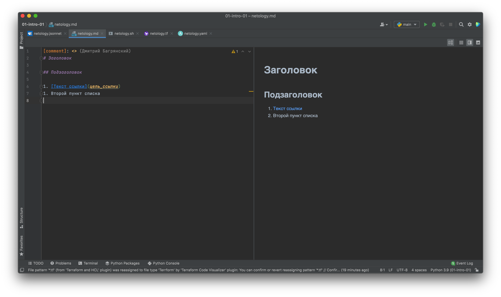
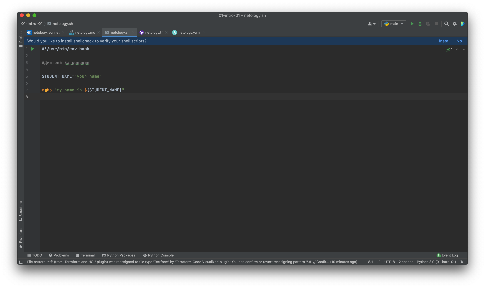
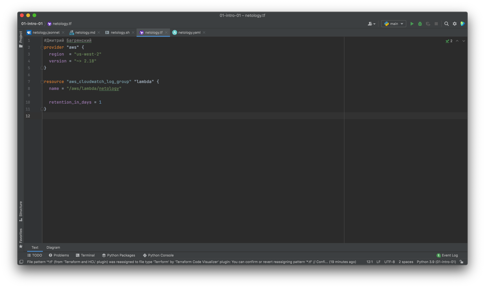
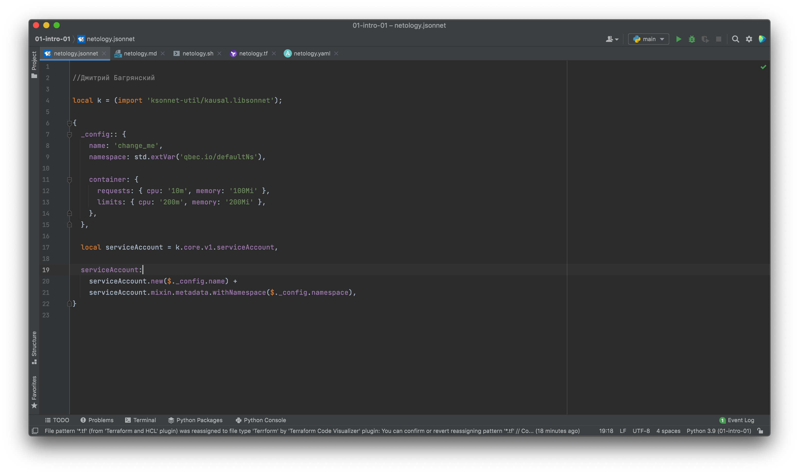

*Студент: Дмитрий Багрянский*

# Домашняя работа

## Урок 1 Введение в DevOps
## Задание #1
* Внес изменения с помощью редактора PyCharm в файлы:

    - netology.md
    - netology.yaml
    - netology.sh
    - netology.tf
    - netology.jsonnet

Путем добавления фамилии и имени в тело файла 
Зафиксировал изменения с помощью скриншотов:
## Markdown

## Yaml

## Bash

## Terraform

## Jsonnet

## Задание #2
Действуюшие лица:
 - Product Manager - PM
 - Product Owner - PO
 - Developers - Dev
 - QA
 - Users
 - Customers
 - DevOps
 
*PM, PO собираются и заполняют Product Backlog учитывая пожелания Customers. PO и Dev собираются и планируют Sprint на основе Product Backlog, формируют Sprint Backlog, ранжируют задачи по сложности. 
Dev выполняют 2-х недельный Sprint тестируя все задачи из Sprint Backlog в тесной связке с командой QA. Формируем Bug Review, пускаем в работу для исправления Bug'ов. Формируем из отлаженных задач Done Sprint. Выкладываем версию 1.0 ПО для Customers & Users. Собираем Feedback. И снова повторяем все действия начиная с формирования Sprint Backlog с добавлением нерешенных задач из Product Backlog и учитывая Feedback от Customers & Users для разработки версии 1.1.* 

*Как устроено все внутри команды Dev и QA:
PM ведёт все задачи в системе Jira. Контроль версий ПО осуществляется в SCM Git. Dev покрывают код автотестами, тестируем ПО с помощью Vagrant с применением Docker. Всю автоматизацию развертывания пишем на Yaml, Python и Bash. Автоматизируем выпуск версий с помощью Jenkins. Управляем ПО во время эксплуатации с помощью Ansible. Централизованный мониторинг ПО во время эксплуатации осуществляем используя Grafana.* 

*DevOps на софтверном уровне помогает взаимодействовать между собой командам Dev и QA. Настраивает и поддерживает работу всех инструментов используемых на различных этапах разработки ПО.*
