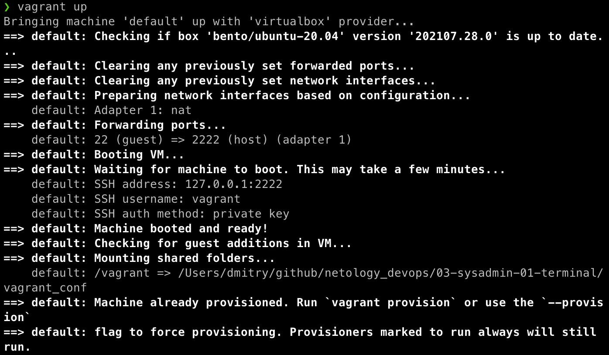
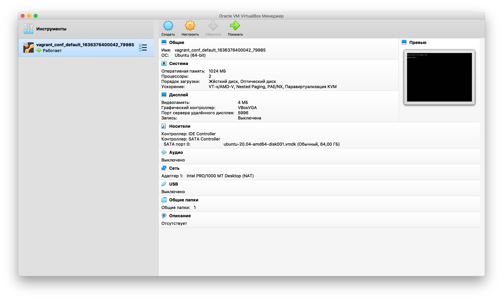
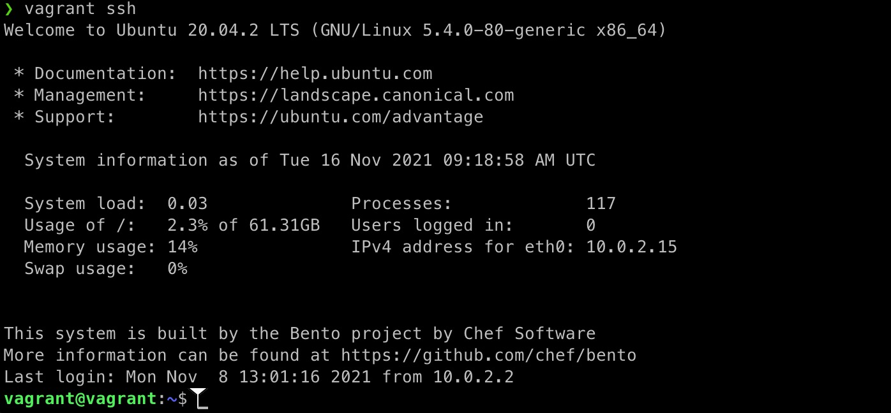

*Студент: Дмитрий Багрянский*

# Домашняя работа

## Урок 3.1 Работа в терминале, лекция 1

1. По ссылке установил VirtualBox версия для MacOS
2. По ссылке установил Vagrant версия для MacOS
3. Уже был установлен терминал iTerm2, сделал кастомизацию путем установки zhs и темы powerlevel10k.
4. Командой mkdir vagrant_conf создал директорию vagrant_conf для хранения конфигурационных файлов Vagrant. С помощью команды cd vagrant_conf перешел в директорию vagrant_conf. Командой vagrant init был создан конфигурационный файл Vagrantfile. Заменил содержимое файла следующим содержимым:
```
Vagrant.configure("2") do |config|
    config.vm.box = "bento/ubuntu-20.04"
end
```
Находясь в корне директории vagrant_conf выполнил команду vagrant up, этой командой Vagrant установит провайдером VirtualBox, скачает образ bento/ubuntu-20.04 и запустит виртуальную машину.


5. Ознакомился с графическим интерфейсом VirtualBox

Для виртуальной машины выделено 1024МБ оперативной памяти, 4МБ видеопамяти, 2 процессорных ядра, подключено ускорение.

6. Изменив конфигурационный файл Vagrantfile следующим образом:
```
Vagrant.configure("2") do |config|
	config.vm.box = "bento/ubuntu-20.04"
#Start change
	config.vm.provider "virtualbox" do |v|
		v.memory = 2048
             	v.cpus = 3
    	end
#End change
end
```
Увеличил оперативную память до 2048МБ и количество ядер процессора до 3-х.

7. Командой vagrant ssh подключаемся к виртуальной машине через ssh протокол


8. Ознакомился с man bash в виртуальной машине.
Длину журнала history можно изменить задав значение переменной окружения, в man bash описываются 2 переменные отвечающие за размер журнала history:
* HISTSIZE - количество строк или команд, которые хранятся в памяти в списке истории
* HISTFILESIZE - количество строк или команд, которые разрешены в файле истории во время запуска сеанса и сохраняются в файле истории в конце вашего сеанса bash
Таким образом общее количество строк/команд в журнале history описываются переменной HISTFILESIZE и это количество строк/команд будет доступно в следующем сеансе bash, а HISTSIZE описывает сколько последних строк/команд попадет в журнал history.
Все эти переменные описываются в файле ~/.bashrc.

Чтобы увеличить размер хранимой истории необходимо в файл ~/.bashrc добавить строки:

export HISTSIZE=10000
export HISTFILESIZE=10000
Теперь будет храниться история последних 10 тыс. команд.

Для применения настроек нужно выполнить:
`source ~/.bashrc`
или перезайти в терминал.

Директива `ignoreboth` в bash.

В bash есть опция HISTCONTROL, которая контролирует каким образом список команд сохраняется в истории.
У нее есть 4 директивы:
* ignorespace — не сохранять строки начинающиеся с символа <пробел>
* ignoredups — не сохранять строки, совпадающие с последней выполненной командой
* ignoreboth — использовать обе опции ‘ignorespace’ и ‘ignoredups’
* erasedups — удалять ВСЕ дубликаты команд с истории

Если в файл ~/.bashrc добавить export HISTCONTROL=ignoreboth:erasedups, то в файле истории не будет дубликатов команд, а также применятся обе директивы ignorespace и ignoredups.

9. Фигурные скобки `{}` применимы в сценариях замены.

Например:

```
vagrant@vagrant:~$ echo a{b,c,d}e
abe ace ade
vagrant@vagrant:~$ mkdir {00..05} && ls -l
total 24
drwxrwxr-x 2 vagrant vagrant 4096 Jan 13 07:29 00
drwxrwxr-x 2 vagrant vagrant 4096 Jan 13 07:29 01
drwxrwxr-x 2 vagrant vagrant 4096 Jan 13 07:29 02
drwxrwxr-x 2 vagrant vagrant 4096 Jan 13 07:29 03
drwxrwxr-x 2 vagrant vagrant 4096 Jan 13 07:29 04
drwxrwxr-x 2 vagrant vagrant 4096 Jan 13 07:29 05
  ```

10. Для того чтобы создать однократным вызовом touch 100000 файлов нужно ввести команду следующим образом:

```
vagrant@vagrant:~$ touch {000000..100000}.txt
vagrant@vagrant:~$ ls -l
total 0
-rw-rw-r-- 1 vagrant vagrant 0 Jan 13 07:35 000000.txt
-rw-rw-r-- 1 vagrant vagrant 0 Jan 13 07:35 000001.txt
-rw-rw-r-- 1 vagrant vagrant 0 Jan 13 07:35 000002.txt
-rw-rw-r-- 1 vagrant vagrant 0 Jan 13 07:35 000003.txt
-rw-rw-r-- 1 vagrant vagrant 0 Jan 13 07:35 000004.txt
-rw-rw-r-- 1 vagrant vagrant 0 Jan 13 07:35 000005.txt
...
-rw-rw-r-- 1 vagrant vagrant 0 Jan 13 07:35 099995.txt
-rw-rw-r-- 1 vagrant vagrant 0 Jan 13 07:35 099996.txt
-rw-rw-r-- 1 vagrant vagrant 0 Jan 13 07:35 099997.txt
-rw-rw-r-- 1 vagrant vagrant 0 Jan 13 07:35 099998.txt
-rw-rw-r-- 1 vagrant vagrant 0 Jan 13 07:35 099999.txt
-rw-rw-r-- 1 vagrant vagrant 0 Jan 13 07:35 100000.txt
```
Попробуем создать 300000 файлов:
```
vagrant@vagrant:~$ touch {000000..300000}.txt
-bash: /usr/bin/touch: Argument list too long
```
получим ошибку `Длина аргументов слишком большая`

Посмотрим максимальное количество символов в командной строке:
```
vagrant@vagrant:~$ xargs --show-limits
Your environment variables take up 2183 bytes
POSIX upper limit on argument length (this system): 2092921
POSIX smallest allowable upper limit on argument length (all systems): 4096
Maximum length of command we could actually use: 2090738
Size of command buffer we are actually using: 131072
Maximum parallelism (--max-procs must be no greater): 2147483647
```

Из вывода команды можно понять, что максимальная длина аргументов командной строки равна: `2090738`

11. Конструкция `[[ -d /tmp ]]` проверяет является ли `/tmp` каталогом:
```
vagrant@vagrant:/$ if [[ -d /tmp ]]; then echo "is a directory"; fi;
is a directory
vagrant@vagrant:~$ touch tmp.txt
vagrant@vagrant:~$ if [[ -d ~/tmp.txt ]]; then echo "is a directory"; else echo "is a file"; fi;
is a file
```
12. Проверим вывод команды `type -a bash`:
```
vagrant@vagrant:~$ type -a bash
bash is /usr/bin/bash
bash is /bin/bash
```
Сделаем `soft link` на `bash` в другом каталоге:
```
vagrant@vagrant:~$ mkdir /tmp/new_dir
vagrant@vagrant:~$ ln -s /bin/bash /tmp/new_dir/bash
vagrant@vagrant:~$ ls -l /tmp/new_dir/
total 0
lrwxrwxrwx 1 vagrant vagrant 9 Jan 13 09:22 bash -> /bin/bash
```
внесем изменения в `~/.profile`, добавим новый путь `/tmp/new_dir` в переменную окружения `$PATH` таким образом чтоб он оказался в начале:

```diff
# if running bash
if [ -n "$BASH_VERSION" ]; then
    # include .bashrc if it exists
    if [ -f "$HOME/.bashrc" ]; then
	. "$HOME/.bashrc"
    fi
fi

# set PATH so it includes user's private bin if it exists
if [ -d "$HOME/bin" ] ; then
    PATH="$HOME/bin:$PATH"
fi

# set PATH so it includes user's private bin if it exists
if [ -d "$HOME/.local/bin" ] ; then
    PATH="$HOME/.local/bin:$PATH"
fi
+
+# set PATH so it includes user's private bin if it +exists
+if [ -d "/tmp/new_dir" ] ; then
+    PATH="/tmp/new_dir:$PATH"
+fi
```
Применим изменения командой `. ./.profile`, проверим переменную окружения:
```
vagrant@vagrant:~$ echo $PATH
/tmp/new_dir:/usr/local/sbin:/usr/local/bin:/usr/sbin:/usr/bin:/sbin:/bin:/usr/games:/usr/local/games:/snap/bin
```
Выполним команду `type -a bash`:
```
vagrant@vagrant:~$ type -a bash
bash is /tmp/new_dir/bash
bash is /usr/bin/bash
bash is /bin/bash
```
13. Отличие команд `at` и `batch`:

Команда at используется для назначения одноразового задания на заданное время
Команда batch используется для назначения одноразовых задач, которые должны выполняться, когда загрузка системы становится меньше 0,8

14. Завершаю работу с виртуальной машиной командой `vagrant suspend`
