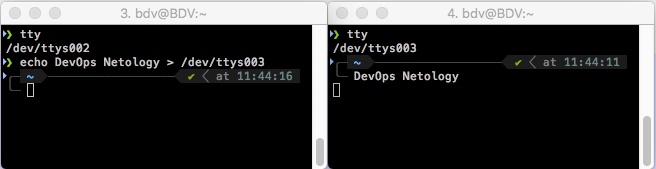

*Студент: Дмитрий Багрянский*

# Домашняя работа

## Урок 3.2 Работа в терминале, лекция 2

1. Какого типа команда `cd`? Попробуйте объяснить, почему она именно такого типа; опишите ход своих мыслей, если считаете что она могла бы быть другого типа.

Команда `cd` встроенного типа. Она встроена в оболочку `bash`, в которой вызывается системная POSIX-функция языка Си `chdir()`. Команда `cd` встроенная потому что она должна влиять на рабочий каталог оболочки из которой она вызвана, в данном случае `bash`, а если бы она была внешняя, то при запуске создавала бы собственный процесс с собственным окружением и каталог изменялся бы внутри этого процесса, не влияя на процесс родитель. По завершению работы внешней утилиты `cd` каталог не был бы изменен.

2. Какая альтернатива без `pipe` команде `grep <some_string> <some_file> | wc -l`? `man grep` поможет в ответе на этот вопрос. Ознакомьтесь с документом о других подобных некорректных вариантах использования `pipe`.

```
vagrant@vagrant:~$ for i in {0..9}; do echo "DevOps Netology" >> test.txt; done
vagrant@vagrant:~$ grep Dev test.txt | wc -l
10
vagrant@vagrant:~$ grep Dev test.txt -c
10
```

3. Какой процесс с `PID 1` является родителем для всех процессов в вашей виртуальной машине `Ubuntu 20.04`?

```
vagrant@vagrant:~$ pstree -p
systemd(1)─┬─VBoxService(845)─┬─{VBoxService}(847)
           │                  ├─{VBoxService}(848)
           │                  ├─{VBoxService}(849)
           │                  ├─{VBoxService}(850)
...
```

4. Как будет выглядеть команда, которая перенаправит вывод `stderr` `ls` на другую сессию терминала?

```
vagrant@vagrant:~$ who
vagrant  pts/0        2022-01-25 06:51 (10.0.2.2)
vagrant  pts/1        2022-01-25 07:51 (10.0.2.2)
vagrant@vagrant:~$ cat tst.txt 2>/dev/pts/1
```

Вывод в сессии `pts/1`

```
vagrant@vagrant:~$ cat: tst.txt: No such file or directory
```

5. Получится ли одновременно передать команде файл на `stdin` и вывести ее `stdout` в другой файл? Приведите работающий пример.

```
vagrant@vagrant:~$ cat test_out.txt; cat < test.txt > test_out.txt; cat test_out.txt
cat: test_out.txt: No such file or directory
DevOps Netology
DevOps Netology
DevOps Netology
...
```

6. Получится ли находясь в графическом режиме, вывести данные из `PTY` в какой-либо из эмуляторов `TTY`? Сможете ли вы наблюдать выводимые данные?

Да, сможем.



7. Выполните команду `bash 5>&1`. К чему она приведет? Что будет, если вы выполните `echo netology > /proc/$$/fd/5`? Почему так происходит?

Команда `bash 5>&1` создаст дескриптор `5` и перенаправит его в `stdout`.
Команда `echo netology > /proc/$$/fd/5` отправит вывод в дескриптор `5` и выведет его на `stdout`

8. Получится ли в качестве входного потока для `pipe` использовать только `stderr` команды, не потеряв при этом отображение `stdout` на `pty`? Напоминаем: по умолчанию через `pipe` передается только `stdout` команды слева от `|` на `stdin` команды справа. Это можно сделать, поменяв стандартные потоки местами через промежуточный новый дескриптор, который вы научились создавать в предыдущем вопросе.

```
vagrant@vagrant:~$ cat tst.txt 4>&1 1>&2 2>&4 | grep No -c
1
```
`4>&1` - новый дескриптор перенаправили в `stdout`

`1>&2` - `stdout` перенаправили в `stderr`

`2>&4` - `stderr` перенаправили в новый дескриптор

9. Что выведет команда `cat /proc/$$/environ`? Как еще можно получить аналогичный по содержанию вывод?

Будут выведены переменные окружения. Аналогичный по содержанию вывод можно получить командами `printenv` или `env`

10. Используя man, опишите что доступно по адресам `/proc/<PID>/cmdline`, `/proc/<PID>/exe`.

`/proc/<PID>/cmdline` - строка с параметрами запуска исполняемого файла

`/proc/<PID>/exe` - символьная ссылка на путь к исполняемому файлу

```
vagrant@vagrant:~$ ps 648
    PID TTY      STAT   TIME COMMAND
    648 ?        Ss     0:00 /usr/bin/dbus-daemon --system --address=systemd: --nofork --nopidfile --systemd-activation --syslog-only
vagrant@vagrant:~$ cat /proc/648/cmdline
/usr/bin/dbus-daemon--system--address=systemd:--nofork--nopidfile--systemd-activation--syslog-only
vagrant@vagrant:~$ sudo ls -l /proc/648/exe
lrwxrwxrwx 1 root root 0 Jan 25 06:50 /proc/648/exe -> /usr/bin/dbus-daemon

```

11. Узнайте, какую наиболее старшую версию набора инструкций `SSE` поддерживает ваш процессор с помощью `/proc/cpuinfo`

```
vagrant@vagrant:~$ grep sse /proc/cpuinfo
```

SSE4_2

12. При открытии нового окна терминала и `vagrant ssh` создается новая сессия и выделяется `pty`. Это можно подтвердить командой `tty`, которая упоминалась в `лекции 3.2`. Однако:
```
vagrant@netology1:~$ ssh localhost 'tty'
not a tty
```
Почитайте, почему так происходит, и как изменить поведение.

При выполнении команды `ssh localhost 'tty'` не выделяется TTY, это позволяет запускать команды, передавать двоичные данные и т.д.

Изменить поведение можно добавив аргумент `-t`, `ssh -t localhost 't'` такой формат команды принудительно выделит TTY при выполнении команды.

```
vagrant@vagrant:~$ ssh -t localhost 'tty'
vagrant@localhost's password:
/dev/pts/2
Connection to localhost closed.
```

13. Бывает, что есть необходимость переместить запущенный процесс из одной сессии в другую. Попробуйте сделать это, воспользовавшись `reptyr`. Например, так можно перенести в `screen` процесс, который вы запустили по ошибке в обычной SSH-сессии.

```
vagrant@vagrant:~$ sudo vim /etc/sysctl.d/10-ptrace.conf
```

Установил в этом файле значение `kernel.yama.ptrace_scope = 0`

Запустил, для теста, команду `7z b`, комбинацией клавиш Ctrl+Z остановил процесс

```
^Z
[1]+  Stopped                 7z b
vagrant@vagrant:~$
```

командой `jobs -l` вывел список задач

```
vagrant@vagrant:~$ jobs -l
[1]+  1451 Stopped                 7z b
```

запустил `screen` и ввел `reptyr 1451` процесс был захвачен и его работа продолжилась в программе `screen`

```
vagrant@vagrant:~$ reptyr 1451
25:         92     3   3763    106  |      69321   198   3119   6170
```
затем нажал комбинацию `Ctrl+A D` выполнив `Detach` процесса.  

14. `sudo echo string > /root/new_file` не даст выполнить перенаправление под обычным пользователем, так как перенаправлением занимается процесс shell'а, который запущен без `sudo` под вашим пользователем. Для решения данной проблемы можно использовать конструкцию `echo string | sudo tee /root/new_file`. Узнайте что делает команда `tee` и почему в отличие от `sudo echo` команда с `sudo tee` будет работать.

Команда `tee` считывает `stdin`, записывает его одновременно в `stdout` и в один или несколько подготовленных файлов. А так как команда запущенна через `sudo`, то есть права на запись в файл.
