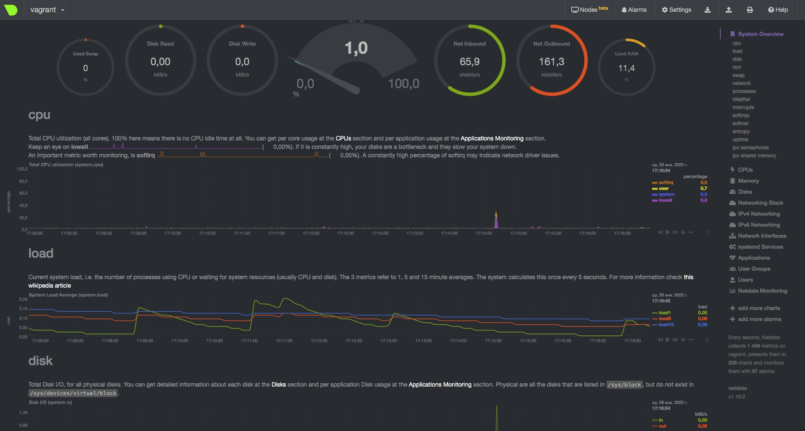

*Студент: Дмитрий Багрянский*

# Домашняя работа

## Урок 3.3 Операционные системы, лекция 2

1. На лекции мы познакомились с [node_exporter](https://github.com/prometheus/node_exporter/releases). В демонстрации его исполняемый файл запускался в background. Этого достаточно для демо, но не для настоящей production-системы, где процессы должны находиться под внешним управлением. Используя знания из лекции по systemd, создайте самостоятельно простой [unit-файл](https://www.freedesktop.org/software/systemd/man/systemd.service.html) для node_exporter:

  * поместите его в автозагрузку,
  * предусмотрите возможность добавления опций к запускаемому процессу через внешний файл (посмотрите, например, на `systemctl cat cron`),
  * удостоверьтесь, что с помощью systemctl процесс корректно стартует, завершается, а после перезагрузки автоматически поднимается.

###### Ответ:

  * Скачал, распаковал и установил node_exporter
  ```bash
$ wget https://github.com/prometheus/node_exporter/releases/download/v1.3.1/node_exporter-1.3.1.linux-amd64.tar.gz
$ tar -xzvf ./node_exporter-1.3.1.linux-amd64.tar.gz
$ cd node_exporter-*.linux-amd64
$ sudo cp node_exporter /usr/local/bin/
  ```
  * Назначил права
```bash
$ sudo useradd --no-create-home --shell /bin/false nodeusr
$ sudo chown -R nodeusr:nodeusr /usr/local/bin/node_exporter
```
  * Создал unit-файл в systemd:
```bash
# /etc/systemd/system/node_exporter.service
[Unit]
Description=Node Exporter Service
After=network.target
[Service]
User=nodeusr
Group=nodeusr
Type=simple
ExecStart=/usr/local/bin/node_exporter
ExecReload=/bin/kill -HUP $MAINPID
Restart=on-failure
EnvironmentFile=/etc/default/node_exporter
[Install]
WantedBy=multi-user.target
```
  * предусмотрел добавление опций через внешний файл
```bash
$ cat /etc/default/node_exporter
SOME_VAR="some value"
```
  * Разрешил автозапуск и запустил службу
```bash
$ sudo systemctl daemon-reload
$ sudo systemctl enable node_exporter
$ sudo systemctl start node_exporter
```
  * проверил работу службы после перезагрузки
  ```bash
$ systemctl status node_exporter
● node_exporter.service - Node Exporter Service
     Loaded: loaded (/etc/systemd/system/node_exporter.service; enabled; vendor preset: enabled)
     Active: active (running) since Wed 2022-01-26 08:01:25 UTC; 33min ago
   Main PID: 659 (node_exporter)
      Tasks: 5 (limit: 2278)
     Memory: 13.1M
     CGroup: /system.slice/node_exporter.service
             └─659 /usr/local/bin/node_exporter
  ```
  * проверил подгрузку внешнего файла указанного в unit-файле
```bash
$ sudo cat /proc/659/environ
LANG=en_US.UTF-8PATH=/usr/local/sbin:/usr/local/bin:/usr/sbin:/usr/bin:/sbin:/bin:/snap/binHOME=/home/nodeusrLOGNAME=nodeusrUSER=nodeusrINVOCATION_ID=f4cbfda6eca545719328d51f5f1306aeJOURNAL_STREAM=9:21180SOME_VAR=some value
```

2. Ознакомьтесь с опциями node_exporter и выводом `/metrics` по-умолчанию. Приведите несколько опций, которые вы бы выбрали для базового мониторинга хоста по CPU, памяти, диску и сети.

###### Ответ:
  * Пробросил порт 9100 на локальный ПК
  ```bash
  config.vm.network "forwarded_port", guest: 9100, host: 9100
  ```
  * Посмотрел вывод `/metrics` по-умолчанию
  

  * Опции для базового мониторинга хоста по CPU, памяти, диску и сети

  ##### CPU:
```bash
node_cpu_seconds_total{cpu="0",mode="idle"}
node_cpu_seconds_total{cpu="0",mode="system"}
node_cpu_seconds_total{cpu="0",mode="user"}
process_cpu_seconds_total
```

  #####  Memory:
```bash
node_memory_MemAvailable_bytes
node_memory_MemFree_bytes
```

  ##### Disk:
```bash
node_disk_io_time_seconds_total{device="sda"}
node_disk_read_bytes_total{device="sda"}
node_disk_read_time_seconds_total{device="sda"}
node_disk_write_time_seconds_total{device="sda"}
```

  ##### Network:
```bash
node_network_receive_errs_total{device="eth0"}
node_network_receive_bytes_total{device="eth0"}
node_network_transmit_bytes_total{device="eth0"}
node_network_transmit_errs_total{device="eth0"}
```

3. Установите в свою виртуальную машину [Netdata](https://github.com/netdata/netdata). Воспользуйтесь [готовыми пакетами](https://packagecloud.io/netdata/netdata/install) для установки (`sudo apt install -y netdata`). После успешной установки:
    * в конфигурационном файле `/etc/netdata/netdata.conf` в секции [web] замените значение с localhost на `bind to = 0.0.0.0`,
    * добавьте в Vagrantfile проброс порта Netdata на свой локальный компьютер и сделайте `vagrant reload`:

    ```bash
    config.vm.network "forwarded_port", guest: 19999, host: 19999
    ```

    После успешной перезагрузки в браузере *на своем ПК* (не в виртуальной машине) вы должны суметь зайти на `localhost:19999`. Ознакомьтесь с метриками, которые по умолчанию собираются Netdata и с комментариями, которые даны к этим метрикам.

###### Ответ:

  * Установил и настроил пакет Netdata
```bash
$ sudo lsof -i :19999
COMMAND PID    USER   FD   TYPE DEVICE SIZE/OFF NODE NAME
netdata 658 netdata    4u  IPv4  23841      0t0  TCP *:19999 (LISTEN)
netdata 658 netdata   22u  IPv4  27391      0t0  TCP vagrant:19999->_gateway:57010 (ESTABLISHED)
```


4. Можно ли по выводу `dmesg` понять, осознает ли ОС, что загружена не на настоящем оборудовании, а на системе виртуализации?

###### Ответ:

  * Да, можно
```bash
$ dmesg | grep virtualiz
[    0.004619] CPU MTRRs all blank - virtualized system.
[    0.175452] Booting paravirtualized kernel on KVM
[    7.221836] systemd[1]: Detected virtualization oracle.
```

5. Как настроен sysctl `fs.nr_open` на системе по-умолчанию? Узнайте, что означает этот параметр. Какой другой существующий лимит не позволит достичь такого числа (`ulimit --help`)?

###### Ответ:

  * `fs.nr_open` - показывает лимит на количество открытых дескрипторов для системы.
  ```bash
$ sysctl -n fs.nr_open
1048576
  ```

  * `ulimit -n` - "мягкий" лимит на пользователя (может быть увеличен в процессе работы до размеров жесткого лимита)
  ```bash
  $ ulimit -n
  1024
  ```

  * `ulimit -Hn` - "жесткий" лимит на пользователя (может быть только уменьшен в процессе работы)
```bash
  $ ulimit -Hn
  1048576
```
  * Оба лимита не могут превышать системный `fs.nr_open`


6. Запустите любой долгоживущий процесс (не `ls`, который отработает мгновенно, а, например, `sleep 1h`) в отдельном неймспейсе процессов; покажите, что ваш процесс работает под PID 1 через `nsenter`. Для простоты работайте в данном задании под root (`sudo -i`). Под обычным пользователем требуются дополнительные опции (`--map-root-user`) и т.д.

###### Ответ:

  ```bash
  $ screen
  $ sudo -i
  unshare -f --pid --mount-proc sleep 1h
  ```
  * Делаем Detach screen `Ctrl+A D`
  
  ```bash
  $ sudo -i
  ps -e | grep sleep
  2407 pts/3    00:00:00 sleep
  nsenter --target 2407 --pid --mount
  ps aux
USER         PID %CPU %MEM    VSZ   RSS TTY      STAT START   TIME COMMAND
root           1  0.0  0.0   5476   596 pts/3    S+   13:58   0:00 sleep 1h
root          14  0.0  0.1   7236  4032 pts/0    S    14:24   0:00 -bash
root          26  0.0  0.1   8892  3332 pts/0    R+   14:24   0:00 ps aux
  ```

7. Найдите информацию о том, что такое `:(){ :|:& };:`. Запустите эту команду в своей виртуальной машине Vagrant с Ubuntu 20.04 (**это важно, поведение в других ОС не проверялось**). Некоторое время все будет "плохо", после чего (минуты) – ОС должна стабилизироваться. Вызов `dmesg` расскажет, какой механизм помог автоматической стабилизации. Как настроен этот механизм по-умолчанию, и как изменить число процессов, которое можно создать в сессии?

###### Ответ:

  * Конструкция `:(){ :|:& };:` - так называемая Fork Bomb.

  Где:

  ```bash
    :()         # имя функции
    {           # тело функции
      : | : &   # вызывает себя 2 раза и помещает работу в фоновый режим  
    };
    :           # снова запускает себя
  ```

  *  вызов `dmesg` показал что сработала защита на максимальное количество запущенных процессов

  ```bash
  [   57.963415] cgroup: fork rejected by pids controller in /user.slice/user-1000.slice/session-4.scope
  ```
  * `PID.max`
  ```bash
  $ cat /sys/fs/cgroup/pids/user.slice/user-1000.slice/pids.max
  5013
  ```
  * Можно изменить данный параметр, отредактировав конфигурационный файл:
  ```bash
  vagrant@vagrant:~$ cat /usr/lib/systemd/system/user-.slice.d/10-defaults.conf
  #  SPDX-License-Identifier: LGPL-2.1+
  #
  #  This file is part of systemd.
  #
  #  systemd is free software; you can redistribute it and/or modify it
  #  under the terms of the GNU Lesser General Public License as published by
  #  the Free Software Foundation; either version 2.1 of the License, or
  #  (at your option) any later version.

  [Unit]
  Description=User Slice of UID %j
  Documentation=man:user@.service(5)
  After=systemd-user-sessions.service
  StopWhenUnneeded=yes

  [Slice]
  TasksMax=33%
  ```
  Изменив в нем значение параметра `TasksMax`, например на 50% получим:

  ```bash
  $ cat /sys/fs/cgroup/pids/user.slice/user-1000.slice/pids.max
  7596
  ```
   
