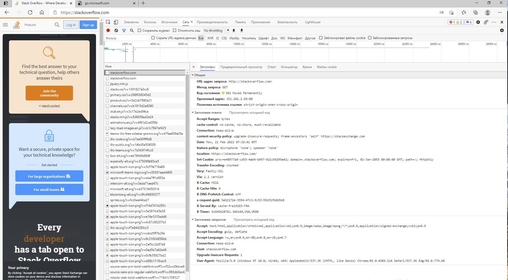
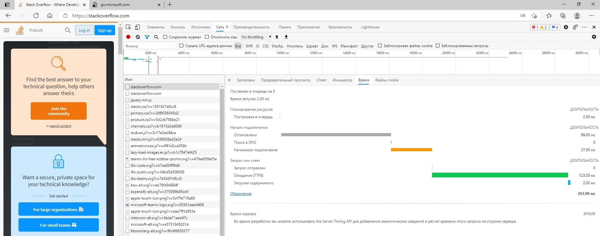

*Студент: Дмитрий Багрянский*

# Домашняя работа

## Урок 3.6 Компьютерные сети, лекция 1

1. Работа c HTTP через телнет.
- Подключитесь утилитой телнет к сайту stackoverflow.com
`telnet stackoverflow.com 80`
- отправьте HTTP запрос
```bash
GET /questions HTTP/1.0
HOST: stackoverflow.com
[press enter]
[press enter]
```
- В ответе укажите полученный HTTP код, что он означает?

###### Ответ:

```bash
vagrant@vagrant:~$ telnet stackoverflow.com 80
Trying 151.101.193.69...
Connected to stackoverflow.com.
Escape character is '^]'.
GET /questions HTTP/1.0
HOST: stackoverflow.com

HTTP/1.1 301 Moved Permanently
cache-control: no-cache, no-store, must-revalidate
location: https://stackoverflow.com/questions
x-request-guid: c24f4f4e-8173-48ca-8a49-a6fea7e2c383
feature-policy: microphone 'none'; speaker 'none'
content-security-policy: upgrade-insecure-requests; frame-ancestors 'self' https://stackexchange.com
Accept-Ranges: bytes
Date: Mon, 21 Feb 2022 06:54:31 GMT
Via: 1.1 varnish
Connection: close
X-Served-By: cache-fra19149-FRA
X-Cache: MISS
X-Cache-Hits: 0
X-Timer: S1645426471.489948,VS0,VE81
Vary: Fastly-SSL
X-DNS-Prefetch-Control: off
Set-Cookie: prov=6ef3838c-a019-cee0-0d54-c274b134a624; domain=.stackoverflow.com; expires=Fri, 01-Jan-2055 00:00:00 GMT; path=/; HttpOnly

Connection closed by foreign host.
```

Выводит сообщение, что ресурс был перемещен на `URL` указанный в поле `location`.

2. Повторите задание 1 в браузере, используя консоль разработчика F12.
- откройте вкладку `Network`
- отправьте запрос http://stackoverflow.com
- найдите первый ответ HTTP сервера, откройте вкладку `Headers`
- укажите в ответе полученный HTTP код.
- проверьте время загрузки страницы, какой запрос обрабатывался дольше всего?
- приложите скриншот консоли браузера в ответ.

###### Ответ:



- время загрузки страницы 263мс
- самый долгий запрос - это ожидание получения первого байта (TTFB)



3. Какой IP адрес у вас в интернете?

###### Ответ:

```bash
vagrant@vagrant:~$ curl ifconfig.me
94.25.174.146
```

4. Какому провайдеру принадлежит ваш IP адрес? Какой автономной системе AS? Воспользуйтесь утилитой `whois`

###### Ответ:

```bash
vagrant@vagrant:~$ whois 94.25.174.146
% This is the RIPE Database query service.
% The objects are in RPSL format.
%
% The RIPE Database is subject to Terms and Conditions.
% See http://www.ripe.net/db/support/db-terms-conditions.pdf

% Note: this output has been filtered.
%       To receive output for a database update, use the "-B" flag.

% Information related to '94.25.168.0 - 94.25.175.255'

% Abuse contact for '94.25.168.0 - 94.25.175.255' is 'abuse-mailbox@megafon.ru'

inetnum:        94.25.168.0 - 94.25.175.255
netname:        SCARTEL-94-25-168-0-21
descr:          YOTA - Moscow and Moskovskaya obl.
country:        RU
admin-c:        MA23317-RIPE
tech-c:         MA23317-RIPE
status:         ASSIGNED PA
mnt-by:         MEGAFON-RIPE-MNT
mnt-by:         GDC-TR-CoreIP
mnt-lower:      GDC-TR-CoreIP
mnt-routes:     GDC-TR-CoreIP
mnt-domains:    MEGAFON-DNS-MNT
mnt-lower:      MEGAFON-AUTO-MNT
created:        2017-11-16T11:24:49Z
last-modified:  2021-08-16T12:55:54Z
source:         RIPE

role:           Mobile
address:        Samara
nic-hdl:        MA23317-RIPE
mnt-by:         GDC-TR-CoreIP
created:        2020-02-05T11:44:29Z
last-modified:  2020-02-05T11:44:29Z
source:         RIPE # Filtered

% Information related to '94.25.174.0/24AS25159'

route:          94.25.174.0/24
descr:          MF-MOSCOW-MBB-94-25-170
origin:         AS25159
mnt-by:         GDC-TR-CoreIP
mnt-by:         MEGAFON-AUTO-MNT
created:        2016-07-22T13:12:35Z
last-modified:  2022-02-11T13:14:59Z
source:         RIPE

% Information related to '94.25.174.0/24AS47395'

route:          94.25.174.0/24
descr:          MF-MOSCOW-MBB-94-25-170
origin:         AS47395
mnt-by:         MEGAFON-AUTO-MNT
mnt-by:         GDC-TR-CoreIP
created:        2016-07-22T13:12:50Z
last-modified:  2022-02-11T13:15:14Z
source:         RIPE

% This query was served by the RIPE Database Query Service version 1.102.2 (HEREFORD)
```

5. Через какие сети проходит пакет, отправленный с вашего компьютера на адрес 8.8.8.8? Через какие AS? Воспользуйтесь утилитой `traceroute`

###### Ответ:

```bash
vagrant@vagrant:~$ traceroute -An 8.8.8.8
traceroute to 8.8.8.8 (8.8.8.8), 30 hops max, 60 byte packets
 1  10.0.2.2 [*]  0.344 ms  0.275 ms  0.259 ms
 2  172.20.10.1 [*]  8.837 ms  8.897 ms  8.975 ms
 3  * * *
 4  * * *
 5  * * *
 6  * * *
 7  * * *
 8  * * *
 9  * * *
10  37.29.105.81 [AS31133]  41.036 ms  40.631 ms  41.249 ms
11  37.29.3.250 [AS31133]  40.368 ms  40.220 ms 178.176.152.61 [AS31133]  26.836 ms
12  108.170.250.34 [AS15169]  31.486 ms  27.946 ms 108.170.250.146 [AS15169]  70.704 ms
13  * 142.250.239.64 [AS15169]  70.617 ms 142.251.49.24 [AS15169]  49.664 ms
14  216.239.43.20 [AS15169]  49.783 ms 74.125.253.109 [AS15169]  49.820 ms 108.170.235.64 [AS15169]  70.379 ms
15  216.239.47.201 [AS15169]  86.385 ms 209.85.251.41 [AS15169]  60.831 ms 172.253.51.243 [AS15169]  59.269 ms
16  * * *
17  * * *
18  * * *
19  * * *
20  * * *
21  * * *
22  * * *
23  * * *
24  * * *
25  8.8.8.8 [AS15169]  57.996 ms  59.651 ms  57.827 ms
```

6. Повторите задание 5 в утилите `mtr`. На каком участке наибольшая задержка - delay?

###### Ответ:

```bash
vagrant@vagrant:~$ mtr -r 8.8.8.8
Start: 2022-02-21T08:36:16+0000
HOST: vagrant                     Loss%   Snt   Last   Avg  Best  Wrst StDev
  1.|-- _gateway                   0.0%    10    0.2   0.2   0.2   0.3   0.0
  2.|-- 172.20.10.1                0.0%    10    6.7   4.4   1.9   6.7   1.7
  3.|-- ???                       100.0    10    0.0   0.0   0.0   0.0   0.0
  4.|-- ???                       100.0    10    0.0   0.0   0.0   0.0   0.0
  5.|-- ???                       100.0    10    0.0   0.0   0.0   0.0   0.0
  6.|-- ???                       100.0    10    0.0   0.0   0.0   0.0   0.0
  7.|-- ???                       100.0    10    0.0   0.0   0.0   0.0   0.0
  8.|-- 83.149.11.158              0.0%    10   30.8  58.6  20.9 186.0  47.4
  9.|-- ???                       100.0    10    0.0   0.0   0.0   0.0   0.0
 10.|-- 37.29.105.81               0.0%    10   44.5  45.7  28.0  87.3  17.3
 11.|-- 37.29.3.250                0.0%    10   23.3  38.3  23.3  69.7  15.5
 12.|-- 108.170.250.51            20.0%    10   46.3  39.0  24.9  58.2  10.3
 13.|-- 216.239.51.32             40.0%    10   80.6  61.2  45.7  80.6  13.8
 14.|-- 216.239.48.224             0.0%    10   49.7  58.4  40.9 124.9  24.3
 15.|-- 142.250.208.23             0.0%    10   39.5  49.9  38.7  71.6  11.3
 16.|-- ???                       100.0    10    0.0   0.0   0.0   0.0   0.0
 17.|-- ???                       100.0    10    0.0   0.0   0.0   0.0   0.0
 18.|-- ???                       100.0    10    0.0   0.0   0.0   0.0   0.0
 19.|-- ???                       100.0    10    0.0   0.0   0.0   0.0   0.0
 20.|-- ???                       100.0    10    0.0   0.0   0.0   0.0   0.0
 21.|-- ???                       100.0    10    0.0   0.0   0.0   0.0   0.0
 22.|-- dns.google                10.0%    10   59.8  65.7  39.6 106.1  17.4
```

Наибольшая задержка `Wrst` на участке 8.

7. Какие DNS сервера отвечают за доменное имя dns.google? Какие A записи? воспользуйтесь утилитой `dig`

###### Ответ:

```bash
vagrant@vagrant:~$ dig NS dns.google
...
;; QUESTION SECTION:
;dns.google.			IN	NS

;; ANSWER SECTION:
dns.google.		4502	IN	NS	ns2.zdns.google.
dns.google.		4502	IN	NS	ns4.zdns.google.
dns.google.		4502	IN	NS	ns1.zdns.google.
dns.google.		4502	IN	NS	ns3.zdns.google.
...

vagrant@vagrant:~$ dig A dns.google
...
;; QUESTION SECTION:
;dns.google.			IN	A

;; ANSWER SECTION:
dns.google.		927	IN	A	8.8.8.8
dns.google.		927	IN	A	8.8.4.4
...
```

8. Проверьте PTR записи для IP адресов из задания 7. Какое доменное имя привязано к IP? воспользуйтесь утилитой `dig`

###### Ответ:

```bash
vagrant@vagrant:~$ dig -x 8.8.8.8
...
;; QUESTION SECTION:
;8.8.8.8.in-addr.arpa.		IN	PTR

;; ANSWER SECTION:
8.8.8.8.in-addr.arpa.	3719	IN	PTR	dns.google.
...
```
