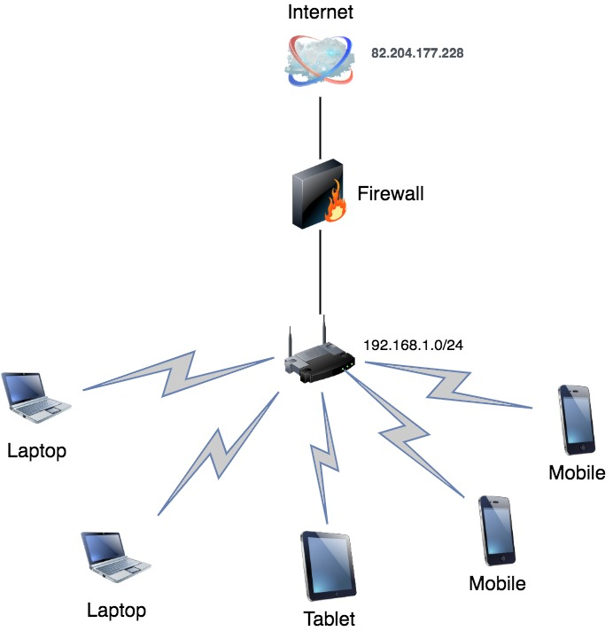

*Студент: Дмитрий Багрянский*

# Домашняя работа

## Урок 3.8 Компьютерные сети, лекция 3

1. Подключитесь к публичному маршрутизатору в интернет. Найдите маршрут к вашему публичному IP
```
telnet route-views.routeviews.org
Username: rviews
show ip route x.x.x.x/32
show bgp x.x.x.x/32
```

###### Ответ:

- Проверил:

```bash
route-views>show ip route 82.204.177.230
Routing entry for 82.204.128.0/17
  Known via "bgp 6447", distance 20, metric 0
  Tag 2497, type external
  Last update from 202.232.0.2 7w0d ago
  Routing Descriptor Blocks:
  * 202.232.0.2, from 202.232.0.2, 7w0d ago
      Route metric is 0, traffic share count is 1
      AS Hops 2
      Route tag 2497
      MPLS label: none
route-views>show bgp 82.204.177.230
BGP routing table entry for 82.204.128.0/17, version 232288
Paths: (23 available, best #19, table default)
  Not advertised to any peer
  Refresh Epoch 1
  6939 8359
    64.71.137.241 from 64.71.137.241 (216.218.252.164)
      Origin IGP, localpref 100, valid, external
      path 7FE15E99C228 RPKI State not found
      rx pathid: 0, tx pathid: 0
  Refresh Epoch 1
  8283 8359
    94.142.247.3 from 94.142.247.3 (94.142.247.3)
      Origin IGP, metric 0, localpref 100, valid, external
      Community: 8283:1 8283:101 8359:5500 8359:55277
      unknown transitive attribute: flag 0xE0 type 0x20 length 0x18
        value 0000 205B 0000 0000 0000 0001 0000 205B
              0000 0005 0000 0001
      path 7FE136637970 RPKI State not found
      rx pathid: 0, tx pathid: 0
```

2. Создайте dummy0 интерфейс в Ubuntu. Добавьте несколько статических маршрутов. Проверьте таблицу маршрутизации.

###### Ответ:

- Создаем интерфейс dummy0, dummy1
```bash
vagrant@vagrant:~$ sudo modprobe -v dummy numdummies=2
insmod /lib/modules/5.4.0-91-generic/kernel/drivers/net/dummy.ko numdummies=0 numdummies=2
vagrant@vagrant:~$ sudo ip addr add 192.168.1.150/24 dev dummy0
vagrant@vagrant:~$ sudo ip addr add 192.168.1.100/24 dev dummy1
vagrant@vagrant:~$ ip -c -br link
lo               UNKNOWN        00:00:00:00:00:00 <LOOPBACK,UP,LOWER_UP>
eth0             UP             08:00:27:b1:28:5d <BROADCAST,MULTICAST,UP,LOWER_UP>
dummy0           DOWN           6e:c6:f7:96:15:16 <BROADCAST,NOARP>
dummy1           DOWN           92:5b:b1:ae:27:45 <BROADCAST,NOARP>
```

- Добавим несколько статических маршрутов

```bash
vagrant@vagrant:~$ sudo ip route add 172.168.102.0/24 dev eth0
vagrant@vagrant:~$ sudo ip route add 172.168.103.0/24 dev eth0
vagrant@vagrant:~$ ip -br route
default via 10.0.2.2 dev eth0 proto dhcp src 10.0.2.15 metric 100
10.0.2.0/24 dev eth0 proto kernel scope link src 10.0.2.15
10.0.2.2 dev eth0 proto dhcp scope link src 10.0.2.15 metric 100
172.168.102.0/24 dev eth0 scope link
172.168.103.0/24 dev eth0 scope link
192.168.1.0/24 dev dummy0 proto kernel scope link src 192.168.1.150
192.168.1.0/24 dev dummy1 proto kernel scope link src 192.168.1.100
```

3. Проверьте открытые TCP порты в Ubuntu, какие протоколы и приложения используют эти порты? Приведите несколько примеров.

###### Ответ:

- Используем команду `ss -tlpn`

```bash
vagrant@vagrant:~$ ss -tlpn
State               Recv-Q              Send-Q                           Local Address:Port                            Peer Address:Port              Process
LISTEN              0                   4096                             127.0.0.53%lo:53                                   0.0.0.0:*
LISTEN              0                   128                                    0.0.0.0:22                                   0.0.0.0:*
LISTEN              0                   4096                                 127.0.0.1:8125                                 0.0.0.0:*
LISTEN              0                   4096                                   0.0.0.0:19999                                0.0.0.0:*
LISTEN              0                   4096                                         *:9100                                       *:*
LISTEN              0                   128                                       [::]:22                                      [::]:*
```

- 22 порт - SSH, 19999 - программа netdata

4. Проверьте используемые UDP сокеты в Ubuntu, какие протоколы и приложения используют эти порты?

###### Ответ:

- Используем команду `ss -ulpn`

```bash
vagrant@vagrant:~$ ss -ulpn
State                Recv-Q               Send-Q                                Local Address:Port                               Peer Address:Port               Process
UNCONN               0                    0                                         127.0.0.1:8125                                    0.0.0.0:*
UNCONN               0                    0                                     127.0.0.53%lo:53                                      0.0.0.0:*
UNCONN               0                    0                                    10.0.2.15%eth0:68                                      0.0.0.0:*
```

- 53 порт - DNS

5. Используя diagrams.net, создайте L3 диаграмму вашей домашней сети или любой другой сети, с которой вы работали.

###### Ответ:


