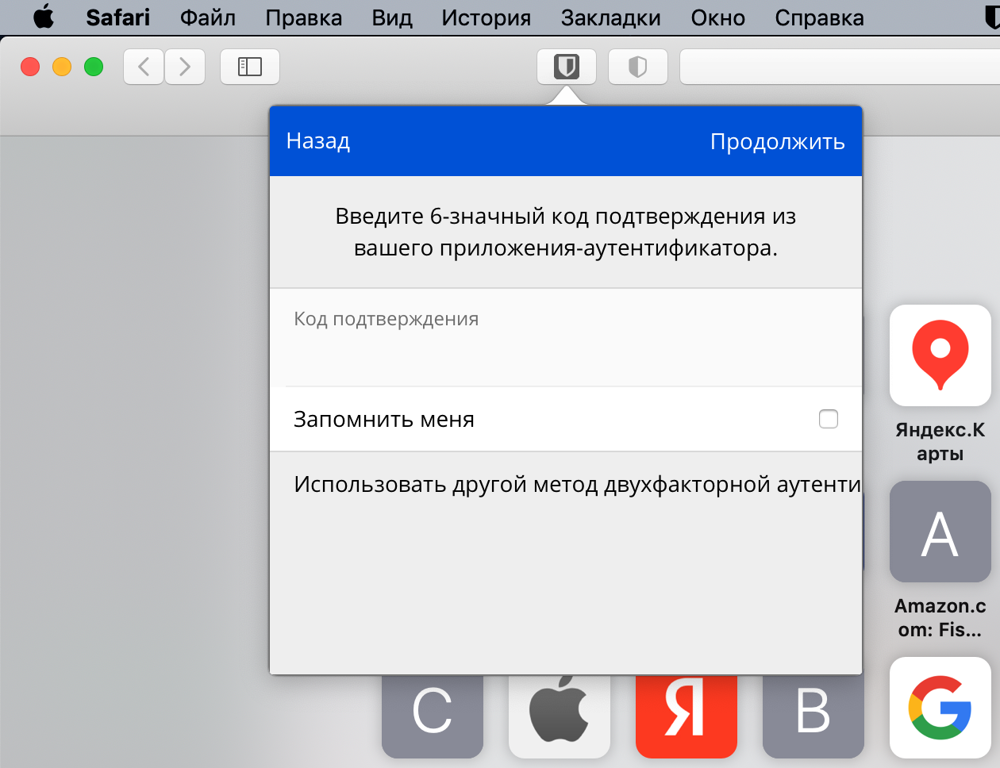

*Студент: Дмитрий Багрянский*

# Домашняя работа

## Урок 3.9 Элементы безопасности информационных систем

1. Установите Bitwarden плагин для браузера. Зарегестрируйтесь и сохраните несколько паролей.

###### Ответ:


2. Установите Google authenticator на мобильный телефон. Настройте вход в Bitwarden акаунт через Google authenticator OTP.

###### Ответ:




3. Установите apache2, сгенерируйте самоподписанный сертификат, настройте тестовый сайт для работы по HTTPS.

###### Ответ:

```bash
vagrant@vagrant:~$ sudo apt-get install apache2
vagrant@vagrant:~$ sudo a2enmod ssl
vagrant@vagrant:~$ sudo openssl req -x509 -nodes -days 365 -newkey rsa:2048 -keyout /etc/ssl/private/apache-selfsigned.key -out /etc/ssl/certs/apache-selfsigned.crt
vagrant@vagrant:~$ sudo openssl x509 -text -noout -in  /etc/ssl/certs/apache-selfsigned.crt | grep Subject:
        Subject: C = RU, ST = Moscow, L = Moscow, O = TestComp, CN = www.test.net
vagrant@vagrant:~$ cat /etc/apache2/sites-available/test.conf
        <VirtualHost *:443>
           ServerName test.net
           DocumentRoot /var/www/test
           SSLEngine on
           SSLCertificateFile /etc/ssl/certs/apache-selfsigned.crt
           SSLCertificateKeyFile /etc/ssl/private/apache-selfsigned.key
        </VirtualHost>
vagrant@vagrant:~$ sudo mkdir /var/www/test
vagrant@vagrant:~$ sudo nano /var/www/test/index.html
vagrant@vagrant:~$ cat /var/www/test/index.html
<h1>it worked!</h1>        
vagrant@vagrant:~$ sudo a2ensite test.conf
```

4. Проверьте на TLS уязвимости произвольный сайт в интернете (кроме сайтов МВД, ФСБ, МинОбр, НацБанк, РосКосмос, РосАтом, РосНАНО и любых госкомпаний, объектов КИИ, ВПК ... и тому подобное).

###### Ответ:

```bash
vagrant@vagrant:~/testssl.sh$ ./testssl.sh -U --sneaky https://www.yandex.ru/

 Start 2022-03-17 09:50:58        -->> 5.255.255.70:443 (www.yandex.ru) <<--
 Further IP addresses:   5.255.255.77 77.88.55.60 77.88.55.88 2a02:6b8:a::a
 rDNS (5.255.255.70):    yandex.ru.
 Service detected:       HTTP

 Testing vulnerabilities

 Heartbleed (CVE-2014-0160)                not vulnerable (OK), no heartbeat extension
 CCS (CVE-2014-0224)                       not vulnerable (OK)
 Ticketbleed (CVE-2016-9244), experiment.  not vulnerable (OK)
 ROBOT                                     not vulnerable (OK)
 Secure Renegotiation (RFC 5746)           supported (OK)
 Secure Client-Initiated Renegotiation     not vulnerable (OK)
 CRIME, TLS (CVE-2012-4929)                not vulnerable (OK)
 BREACH (CVE-2013-3587)                    potentially NOT ok, "br gzip deflate" HTTP compression detected. - only supplied "/" tested
                                           Can be ignored for static pages or if no secrets in the page
 POODLE, SSL (CVE-2014-3566)               not vulnerable (OK)
 TLS_FALLBACK_SCSV (RFC 7507)              Downgrade attack prevention supported (OK)
 SWEET32 (CVE-2016-2183, CVE-2016-6329)    VULNERABLE, uses 64 bit block ciphers
 FREAK (CVE-2015-0204)                     not vulnerable (OK)
 DROWN (CVE-2016-0800, CVE-2016-0703)      not vulnerable on this host and port (OK)
                                           make sure you don't use this certificate elsewhere with SSLv2 enabled services
                                           https://censys.io/ipv4?q=4E834EA0CDB43145A0FDDA1882E0DBF10CF1643376DD43ED949E802880401365 could help you to find out
 LOGJAM (CVE-2015-4000), experimental      not vulnerable (OK): no DH EXPORT ciphers, no DH key detected with <= TLS 1.2
 BEAST (CVE-2011-3389)                     TLS1: ECDHE-RSA-AES128-SHA AES128-SHA DES-CBC3-SHA
                                           VULNERABLE -- but also supports higher protocols  TLSv1.1 TLSv1.2 (likely mitigated)
 LUCKY13 (CVE-2013-0169), experimental     potentially VULNERABLE, uses cipher block chaining (CBC) ciphers with TLS. Check patches
 Winshock (CVE-2014-6321), experimental    not vulnerable (OK)
 RC4 (CVE-2013-2566, CVE-2015-2808)        no RC4 ciphers detected (OK)

 Done 2022-03-17 09:51:31 [  35s] -->> 5.255.255.70:443 (www.yandex.ru) <<--
```

5. Установите на Ubuntu ssh сервер, сгенерируйте новый приватный ключ. Скопируйте свой публичный ключ на другой сервер. Подключитесь к серверу по SSH-ключу.

###### Ответ:

```bash
vagrant@vagrant:~$ sudo apt install openssh-server
vagrant@vagrant:~$ sudo systemctl start sshd
vagrant@vagrant:~$ sudo systemctl enable sshd
vagrant@vagrant:~$ ssh-keygen
Generating public/private rsa key pair.
Enter file in which to save the key (/home/vagrant/.ssh/id_rsa):
Enter passphrase (empty for no passphrase):
Enter same passphrase again:
Your identification has been saved in /home/vagrant/.ssh/id_rsa
Your public key has been saved in /home/vagrant/.ssh/id_rsa.pub
vagrant@vagrant:~$ ssh-copy-id bdv@10.211.55.3
/usr/bin/ssh-copy-id: INFO: Source of key(s) to be installed: "/home/vagrant/.ssh/id_rsa.pub"
/usr/bin/ssh-copy-id: INFO: attempting to log in with the new key(s), to filter out any that are already installed
/usr/bin/ssh-copy-id: INFO: 1 key(s) remain to be installed -- if you are prompted now it is to install the new keys
vagrant@vagrant:~$ ssh 'bdv@10.211.55.3'
Welcome to Ubuntu 20.04.3 LTS (GNU/Linux 5.13.0-35-generic x86_64)
Your Hardware Enablement Stack (HWE) is supported until April 2025.
Last login: Wed Dec 29 11:45:24 2021 from 10.211.55.2
bdv@parallels:~$
```

6. Переименуйте файлы ключей из задания 5. Настройте файл конфигурации SSH клиента, так чтобы вход на удаленный сервер осуществлялся по имени сервера.

###### Ответ:

```bash
vagrant@vagrant:~$ mv ./.ssh/id_rsa.pub ./.ssh/other.pub
vagrant@vagrant:~$ mv ./.ssh/id_rsa ./.ssh/other
vagrant@vagrant:~$ nano ./.ssh/config
vagrant@vagrant:~$ chown 600 ./.ssh/config
vagrant@vagrant:~$ cat ./.ssh/config
Host ubuntu_parallels
	HostName 10.211.55.3
	IdentityFile ~/.ssh/other
	User bdv
vagrant@vagrant:~$ ssh ubuntu_parallels 'ip -br address'
  lo               UNKNOWN        127.0.0.1/8 ::1/128
  enp0s5           UP             10.211.55.3/24 fdb2:2c26:f4e4:0:5aa9:2651:5285:e6bd/64
```

7. Соберите дамп трафика утилитой tcpdump в формате pcap, 100 пакетов. Откройте файл pcap в Wireshark.

###### Ответ:

```bash
vagrant@vagrant:~$ screen ping 8.8.8.8
[detached from 31342.pts-0.vagrant]
vagrant@vagrant:~$ sudo tcpdump -c 100 -w 0001.pcap -i eth0
tcpdump: listening on eth0, link-type EN10MB (Ethernet), capture size 262144 bytes
100 packets captured
100 packets received by filter
0 packets dropped by kernel
```


