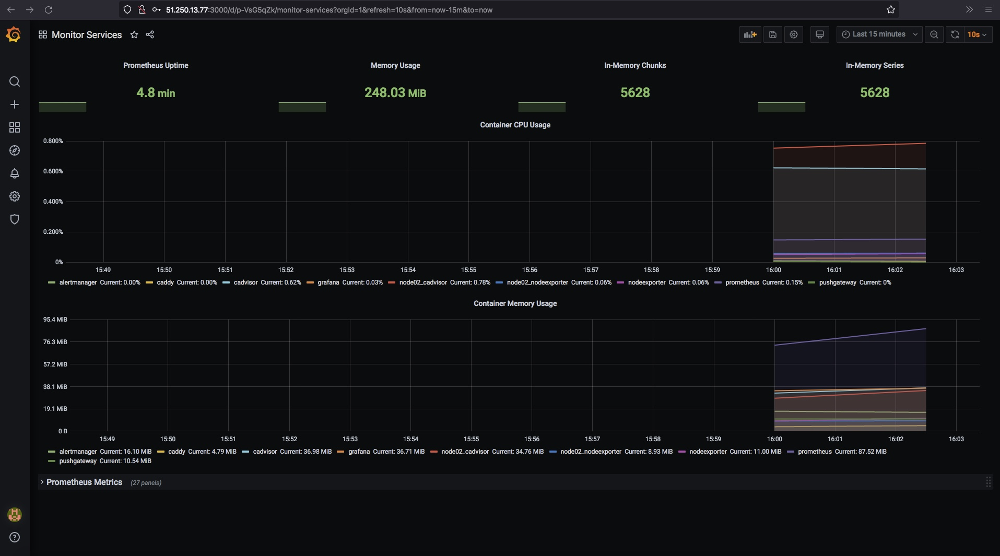

*Студент: Дмитрий Багрянский*

# Домашняя работа

## Урок 5.4. Оркестрация группой Docker контейнеров на примере Docker Compose

## Задача 1

Создать собственный образ операционной системы с помощью Packer.

Для получения зачета, вам необходимо предоставить:
- Скриншот страницы, как на слайде из презентации (слайд 37).

###### Ответ:

*
```bash
packer build centos-7-base.json

yandex: output will be in this color.

==> yandex: Creating temporary RSA SSH key for instance...
==> yandex: Using as source image: fd8hqa9gq1d59afqonsf (name: "centos-7-v20220530", family: "centos-7")
==> yandex: Creating network...
==> yandex: Creating subnet in zone "ru-central1-a"...
==> yandex: Creating disk...
==> yandex: Creating instance...
==> yandex: Waiting for instance with id fhm0t1h0b5l7desubicv to become active...
    yandex: Detected instance IP: 51.250.90.17
==> yandex: Using SSH communicator to connect: 51.250.90.17
==> yandex: Waiting for SSH to become available...
==> yandex: Connected to SSH!
==> yandex: Provisioning with shell script: /var/folders/6f/tgsrct3n0_q00_w4_ywmnmwc0000gn/T/packer-shell3711353902
    yandex: Loaded plugins: fastestmirror
    yandex: Loading mirror speeds from cached hostfile
    yandex:  * base: centos-mirror.rbc.ru
    yandex:  * extras: mirror.yandex.ru
    yandex:  * updates: mirror.yandex.ru
    yandex: Resolving Dependencies
    yandex: --> Running transaction check
    yandex: ---> Package rsyslog.x86_64 0:8.24.0-57.el7_9.2 will be updated
    yandex: ---> Package rsyslog.x86_64 0:8.24.0-57.el7_9.3 will be an update
    yandex: --> Finished Dependency Resolution
    yandex:
    yandex: Dependencies Resolved
    yandex:
    yandex: ================================================================================
    yandex:  Package         Arch           Version                   Repository       Size
    yandex: ================================================================================
    yandex: Updating:
    yandex:  rsyslog         x86_64         8.24.0-57.el7_9.3         updates         622 k
    yandex:
    yandex: Transaction Summary
    yandex: ================================================================================
    yandex: Upgrade  1 Package
.......
.......
yandex: Complete!
==> yandex: Stopping instance...
==> yandex: Deleting instance...
    yandex: Instance has been deleted!
==> yandex: Creating image: centos-7-base
==> yandex: Waiting for image to complete...
==> yandex: Success image create...
==> yandex: Destroying subnet...
    yandex: Subnet has been deleted!
==> yandex: Destroying network...
    yandex: Network has been deleted!
==> yandex: Destroying boot disk...
    yandex: Disk has been deleted!
Build 'yandex' finished after 2 minutes 10 seconds.

==> Wait completed after 2 minutes 10 seconds

==> Builds finished. The artifacts of successful builds are:
--> yandex: A disk image was created: centos-7-base (id: fd80v8uhgg93d2melteg) with family name centos
❯ yc compute image list
+----------------------+---------------+--------+----------------------+--------+
|          ID          |     NAME      | FAMILY |     PRODUCT IDS      | STATUS |
+----------------------+---------------+--------+----------------------+--------+
| fd80v8uhgg93d2melteg | centos-7-base | centos | f2e6pmk175tq39ma7vhb | READY  |
+----------------------+---------------+--------+----------------------+--------+
```

<p align="center">
  
</p>


## Задача 2

Создать вашу первую виртуальную машину в Яндекс.Облаке.

Для получения зачета, вам необходимо предоставить:
- Скриншот страницы свойств созданной ВМ, как на примере ниже:

<p align="center">
  
</p>

###### Ответ:

* В консоле управления YandexCloud или cредствами CLI создаём сервисный аккаунт `service-acc01`

```Bash
yc iam service-account create --name service-acc01 \
  --description "service account-01"
```

* Назначаем сервисному аккаунту `service-acc01` роль `editor`
```Bash
yc iam service-account get service-acc01 | grep -w id:
id: aje04em80fa9vr3mm78a
yc resource-manager folder add-access-binding my-folder \
  --role editor \
  --subject serviceAccount:aje04em80fa9vr3mm78a
```

* Создаем авторизованный ключ для сервисного аккаунта и записывам в файл `key.json`

```Bash
yc iam key create --service-account-name service-acc01 --output key.json
id: ajetsa8falva6kgoj0qn
service_account_id: aje31prltt8tsmk417cr
created_at: "2022-06-08T10:02:14.759966202Z"
key_algorithm: RSA_2048
```
* Редактируем `./src/terraform/variables.tf` под свои `id`

* Инициализируем конфигурацию terraform
```bash
terraform init
```

* Просматриваем что будет создано в облаке
```Bash
terraform plan
```

* Применяем план terraform в облако
```Bash
terraform apply
```

* Удаление плана terraform из облака
```bash
terraform destroy
```

В результате была создана виртуальная машина:
* node01
  * ip_external: 51.250.2.172

<p align="center">
    
</p>

## Задача 3

Создать ваш первый готовый к боевой эксплуатации компонент мониторинга, состоящий из стека микросервисов.

Для получения зачета, вам необходимо предоставить:
- Скриншот работающего веб-интерфейса Grafana с текущими метриками, как на примере ниже
<p align="center">
  
</p>

###### Ответ:

* Перейдем в папку `./src/ansible` и выполним playbook

```bash
ansible-playbook provision.yml

PLAY [nodes] ********************************************************************************************************************************************************

TASK [Gathering Facts] **********************************************************************************************************************************************
ok: [node01.netology.cloud]

TASK [Create directory for ssh-keys] ********************************************************************************************************************************
ok: [node01.netology.cloud]
.....
.....
PLAY RECAP **********************************************************************************************************************************************************
node01.netology.cloud      : ok=12   changed=9    unreachable=0    failed=0    skipped=0    rescued=0    ignored=0
```

* В браузере введем внешний ip виртуальной машины и порт на котором висит Grafana `51.250.2.172:3000`

<p align="center">
  
</p>

## Задача 4 (*)

Создать вторую ВМ и подключить её к мониторингу развёрнутому на первом сервере.

Для получения зачета, вам необходимо предоставить:
- Скриншот из Grafana, на котором будут отображаться метрики добавленного вами сервера.

###### Ответ:

* Конфигурация в папке `./src_two_node`

<p align="center">
  
  
</p>
