*Студент: Дмитрий Багрянский*

# Домашняя работа

## Урок 9.6 Gitlab.

## Подготовка к выполнению

1. Необходимо [подготовить gitlab к работе по инструкции](https://cloud.yandex.ru/docs/tutorials/infrastructure-management/gitlab-containers)
2. Создайте свой новый проект
3. Создайте новый репозиторий в gitlab, наполните его [файлами](./repository)
4. Проект должен быть публичным, остальные настройки по желанию

## Основная часть

### DevOps

В репозитории содержится код проекта на python. Проект - RESTful API сервис. Ваша задача автоматизировать сборку образа с выполнением python-скрипта:
1. Образ собирается на основе [centos:7](https://hub.docker.com/_/centos?tab=tags&page=1&ordering=last_updated)
2. Python версии не ниже 3.7
3. Установлены зависимости: `flask` `flask-restful`
4. Создана директория `/python_api`
5. Скрипт из репозитория размещён в /python_api
6. Точка вызова: запуск скрипта
7. Если сборка происходит на ветке `master`: должен подняться pod kubernetes на основе образа `python-api`, иначе этот шаг нужно пропустить

### Product Owner

Вашему проекту нужна бизнесовая доработка: необходимо поменять JSON ответа на вызов метода GET `/rest/api/get_info`, необходимо создать Issue в котором указать:
1. Какой метод необходимо исправить
2. Текст с `{ "message": "Already started" }` на `{ "message": "Running"}`
3. Issue поставить label: feature

### Developer

Вам пришел новый Issue на доработку, вам необходимо:
1. Создать отдельную ветку, связанную с этим issue
2. Внести изменения по тексту из задания
3. Подготовить Merge Requst, влить необходимые изменения в `master`, проверить, что сборка прошла успешно


### Tester

Разработчики выполнили новый Issue, необходимо проверить валидность изменений:
1. Поднять докер-контейнер с образом `python-api:latest` и проверить возврат метода на корректность
2. Закрыть Issue с комментарием об успешности прохождения, указав желаемый результат и фактически достигнутый

## Итог

В качестве ответа предоставьте подробные скриншоты по каждому пункту задания: файл gitlab-ci.yml, Dockerfile, лог успешного выполнения пайплайна, решенный Issue.

### :bangbang: После выполнения задания выключите и удалите все задействованные ресурсы в Yandex.Cloud.

## Необязательная часть

Автомазируйте работу тестировщика, пусть у вас будет отдельный конвейер, который автоматически поднимает контейнер и выполняет проверку, например, при помощи curl. На основе вывода - будет приниматься решение об успешности прохождения тестирования

---

###### Ответы:

## Подготовка к выполнению

Для выполнения домашнего задания я использовал инструменты Vagrant, Ansible.

Для создания ВМ необходимо подготовить файл окружения с переменными:

.env
```bash
docker_registry=https://index.docker.io
docker_username=docker_user
docker_password=docker_token
docker_image=centos:7

gitlab_registry=gitlab.netology.local
gitlab_username=gitlab_user
gitlab_password=gitlab_password

gitlab_url=gitlab.netology.local
gitlab_runner_token=gitlab_runner_token
gitlab_extra_hosts=192.168.99.XXX

### Для создания персонального самоподписанного сертификата
ca_c=RU
ca_st=Moscow
ca_l=Moscow
ca_o=Netology
ca_ou=DevOps
ca_cn=Personal Certificate
ca_days=365
```

С помощью `Vagrantfile` была создана локальная ВМ с ip:`192.168.99.96`

```bash
vagrant up
```

После создания ВМ, запускается ansible playbook `provision.yml`, настраивает ВМ и Gitlab.

В Gitlab активирован Gitlab Container Registry для хранения docker сборок.

## Основная часть

## Первичная настройка сервера GitLab

- Получим пароль администратора GitLab с помощью команды ВМ:

```bash
vagrant ssh -c "cat /opt/gitlab/config/initial_root_password"
```

- Добавим Gitlab URL в файл hosts на локальной машине

```bash
cat /etc/hosts
192.168.99.96 gitlab.netology.local
```

- Откроем веб панель управления GitLab

```bash
https://gitlab.netology.local:4433
```

- Войдем в Gitlab с учетной записью root
- Создадим пользователя
- Войдем в Gitlab под созданным пользователем
- Добавим ssh public key для доступа по ssh к Gitlab
- Создадим проект netology
    - Create blank project
    - Project name: netology
    - Visibility level: public

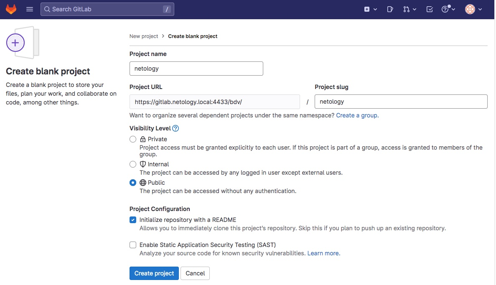

- В настройках проекта разрешим `force push` в ветку main

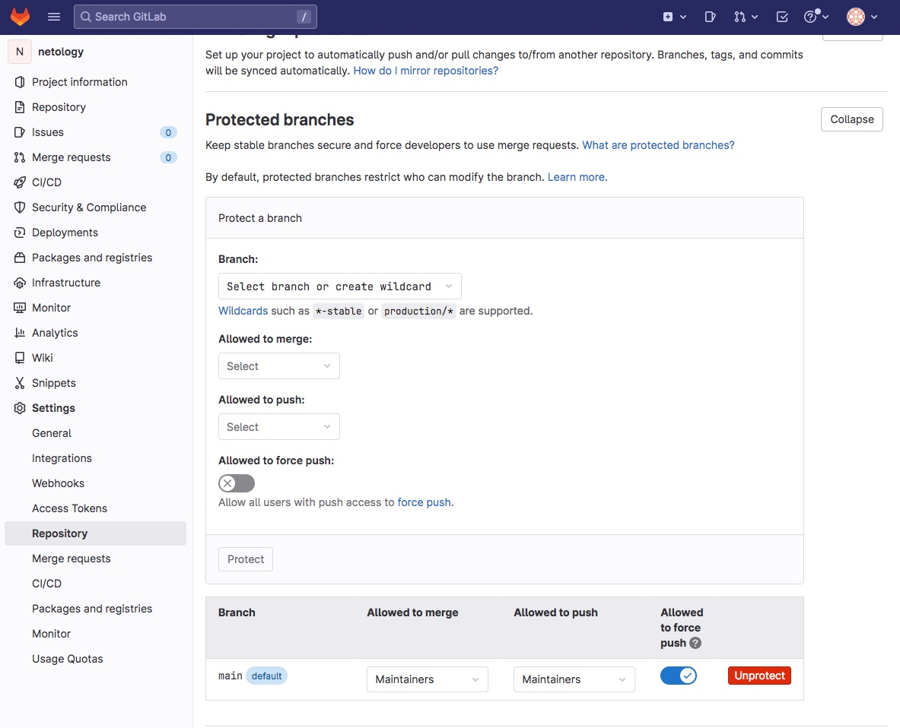  

- На локальной машине создадим папку и организуем в ней git репозиторий

```bash
cd ~
mkdir -p ./repo/netology
cd ./repo/netology
git init
touch .gitlab-ci.yml
touch README.md
mkdir ./app
cd ./app
wget https://github.com/netology-code/mnt-homeworks/blob/MNT-13/09-ci-06-gitlab/repository/python-api.py
touch Dockerfile
touch requirements.txt
```

- Заполним созданные файлы

```bash
cat ./app/Dockerfile

FROM centos:7

RUN yum install python3 python3-pip -y
COPY ./requirements.txt /python_api/requirements.txt
WORKDIR /python_api
RUN pip3 install -r requirements.txt
COPY python-api.py python-api.py
CMD ["python3", "python-api.py"]
```

```bash
cat ./app/requirements.txt

flask
flask_restful
flask_jsonpify

```

```bash
cat .gitlab-ci.yml

stages:
  - build
  - deploy
image: docker:20.10.16
variables:
  DOCKER_TLS_CERTDIR: ""
services:
  - docker:20.10.16-dind
builder:
  stage: build
  script:
    - docker build -t python-api:latest ./app
  except:
    - main
deployer:
  stage: deploy
  script:
    - docker login -u $CI_REGISTRY_USER -p $CI_REGISTRY_PASSWORD $CI_REGISTRY
    - docker build --pull -t "$CI_REGISTRY_IMAGE" ./app
    - docker push "$CI_REGISTRY_IMAGE"
  only:
    - main
```

```bash
cat README.md

# netology

Simple python project
```

- Подключим к репозиторию сервер Gitlab

```bash
git remote add origin ssh://git@gitlab.netology.local:2022/bdv/netology.git
git config --local user.name "Ivan Ivanov"
git config --local user.email "ivan_ivanov@email.com"
git config --local http.sslverify false
```

- Создадим GPG ключ

```bash
gpg --batch --gen-key <<EOF
Key-Type: RSA
Key-Length: 2048
Name-Real: Ivan Ivanov
Name-Email: ivan_ivanov@email.com
Expire-Date: 0
%no-ask-passphrase
%no-protection
EOF
```

- Выведем все ключи

```bash
gpg -K --keyid-format SHORT
```

- Экспортируем ключ

```bash
gpg --armor --export DBDC4B45
```

- Добавим GPG ключ на сервер Gitlab

- Добавим GPG подпись в конфигурацию репозитория

```bash
git config --local user.signingkey DBDC4B45
```

- Отправим проект на сервер Gitlab

```bash
cd ~/repo/netology
git add .
git commit -am "Init simple python project"
git branch -M main
git push -uf origin main
```
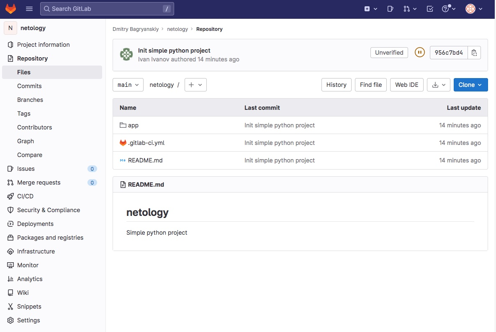

- Зарегистрируем Gitlab Runner
    - Возьмем registration token из вкладки CI/CD настроек репозитория в Gitlab

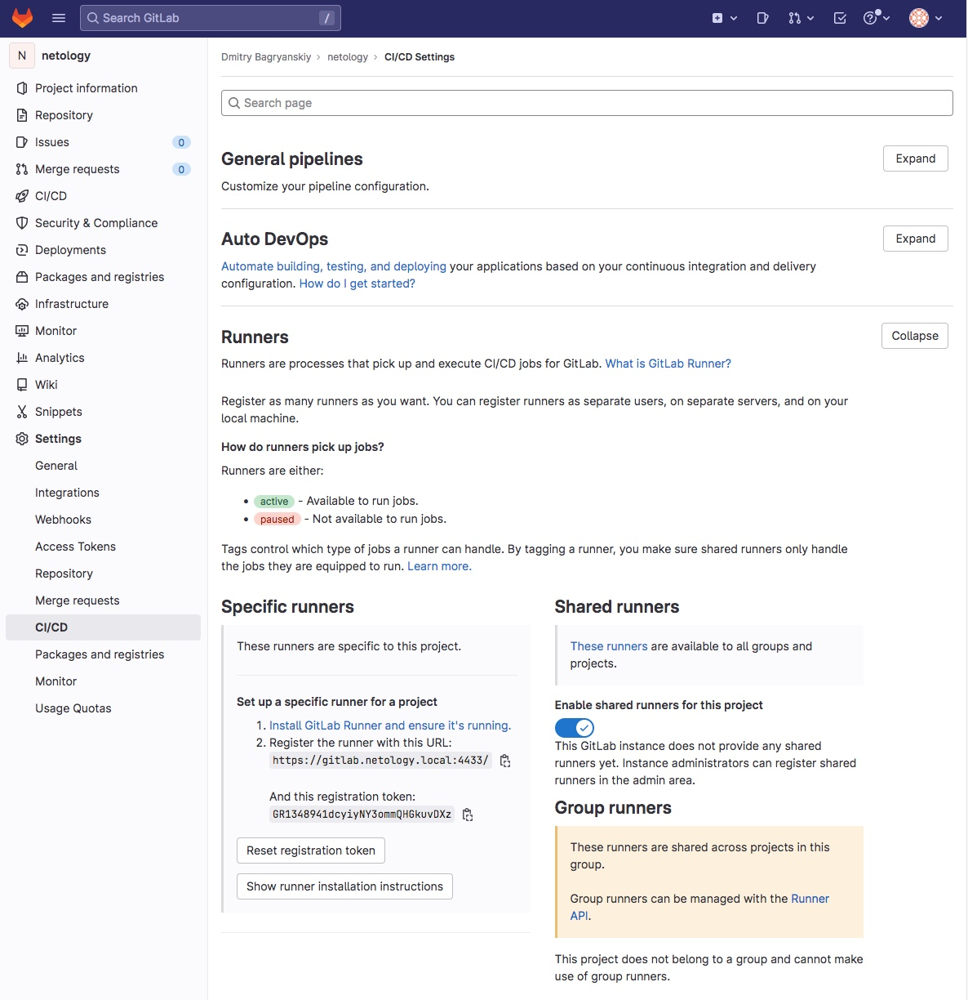

- Заменим registration token в файле /opt/gitlab/runner/docker-compose.yml на ВМ

```bash
vagrant ssh -c "sudo sed -i s:REGISTRATION_TOKEN=.*:REGISTRATION_TOKEN=_new_token_: /opt/gitlab/runner/docker-compose.yml"
```

- Запустим файл /opt/gitlab/runner/docker-compose.yml

```bash
vagrant ssh -c "sudo docker-compose -f /opt/gitlab/runner/docker-compose.yml up -d --remove-orphans"
Recreating runner_register-runner_1 ... done
```

- Проверим, что GitLab Runner зарегистрировался

```bash
vagrant ssh -c "docker logs runner_register-runner_1"
Runtime platform                                    arch=amd64 os=linux pid=7 revision=d540b510 version=15.9.1
Running in system-mode.

WARNING: Support for registration tokens and runner parameters in the 'register' command has been deprecated in GitLab Runner 15.6 and will be replaced with support for authentication tokens. For more information, see https://gitlab.com/gitlab-org/gitlab/-/issues/380872
Registering runner... succeeded                     runner=GR1348941dcyiyNY3
Runner registered successfully. Feel free to start it, but if it's running already the config should be automatically reloaded!

Configuration (with the authentication token) was saved in "/etc/gitlab-runner/config.toml"
```

- Проверим, что GitLab Runner подключился в панели управления GitLab

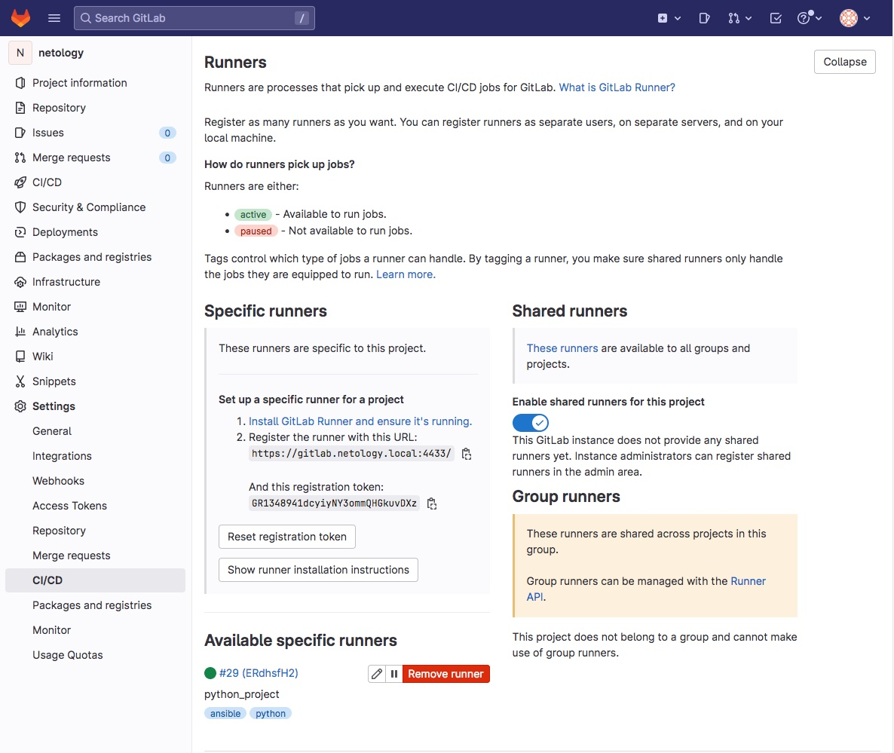

- Добавим `CI/CD Variables` в сценарий тестирования

```bash
CI_REGISTRY_USER=bdv
CI_REGISTRY_PASSWORD=********
CI_REGISTRY=gitlab.netology.local:5555
CI_REGISTRY_IMAGE=gitlab.netology.local:5555/bdv/netology
```

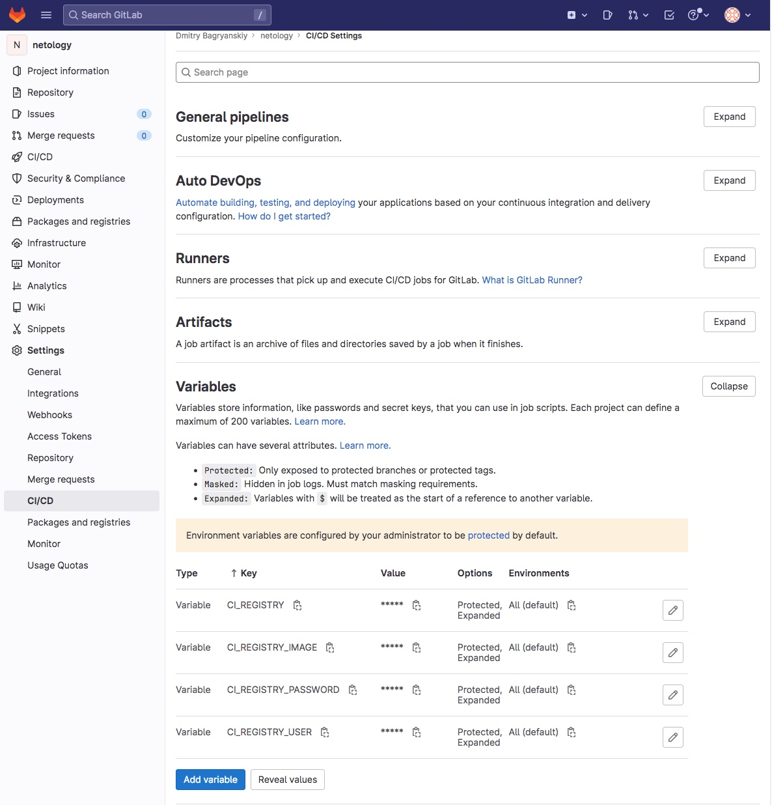

- Запустим `CI/CD Pipeline`

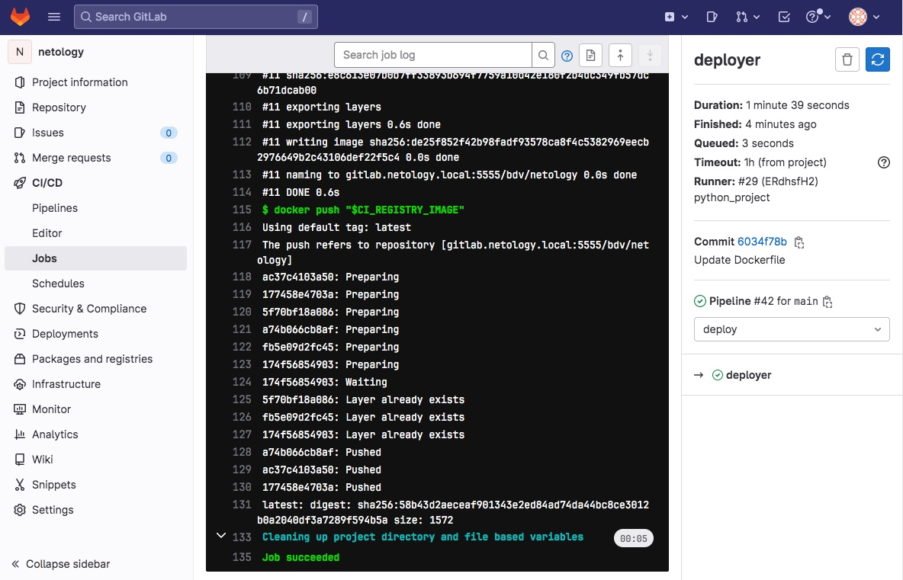

- Создадим Issue
    - Issues / New issue
    - Title: Изменить message
    - Description: Изменить текст с { "message": "Already started" } на { "message": "Running"}
    - Lables: Create project label
        - Name: feature

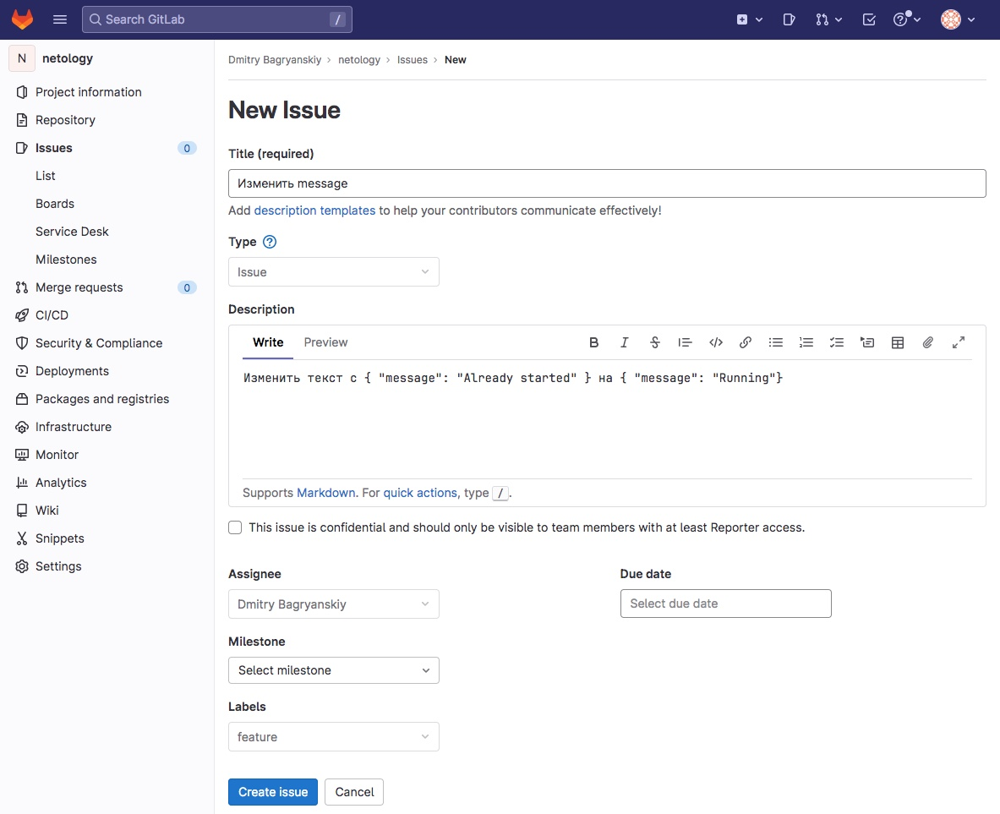

- Создадим отдельную ветку для изменения

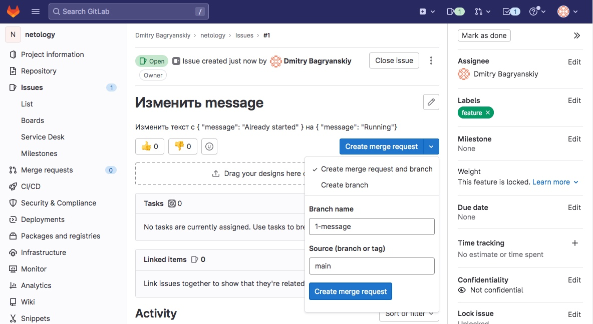

- Создадим merge request

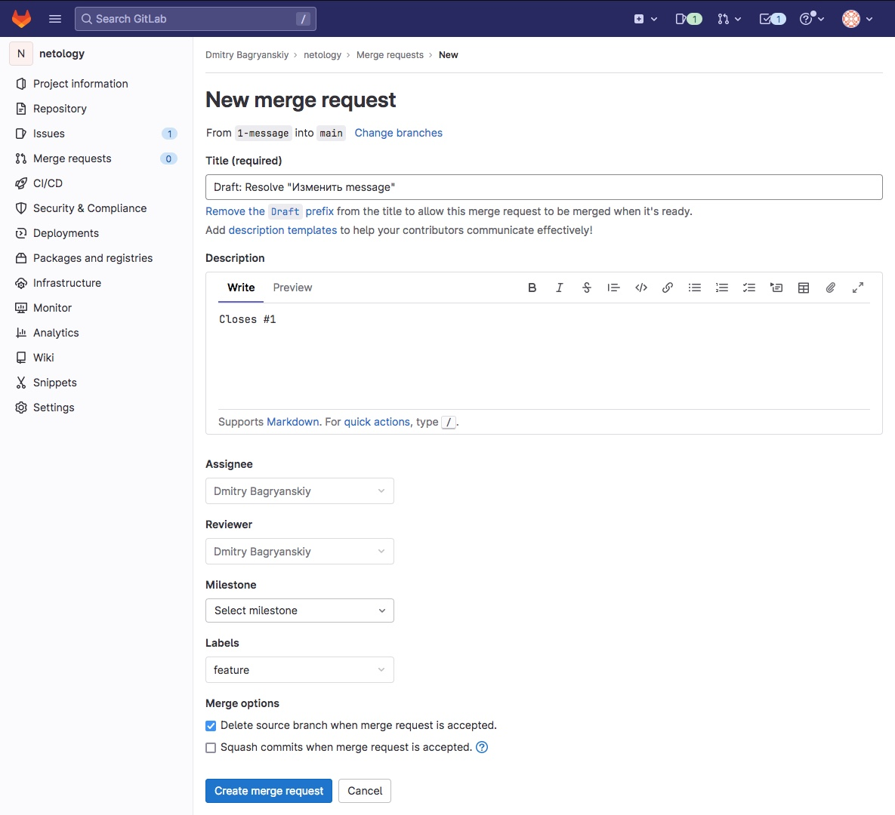

- Перейдем на новую ветку в локальном репозитории

```bash
git fetch
From ssh://gitlab.netology.local:2022/bdv/netology
 * [new branch]      1-message  -> origin/1-message
git checkout 1-message
Branch '1-message' set up to track remote branch '1-message' from 'origin'.
Switched to a new branch '1-message'
```

- Отредактируем файл python-api.py изменив значение message

```bash
from flask import Flask, request
from flask_restful import Resource, Api
from json import dumps
from flask_jsonpify import jsonify

app = Flask(__name__)
api = Api(app)

class Info(Resource):
    def get(self):
        return {'version': 3, 'method': 'GET', 'message': 'Running'}

api.add_resource(Info, '/get_info')

if __name__ == '__main__':
     app.run(host='0.0.0.0', port='5290')
```

- Отправим изменения на сервер Gitlab

```bash
git add .
git commit -am "Change python-api.py"
git push
```

- Применим изменения

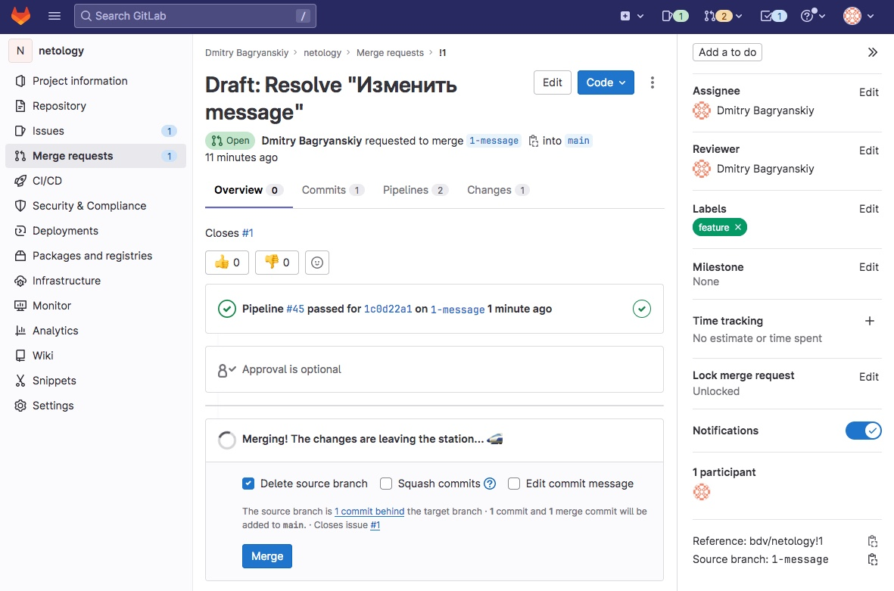

- Перейдем на вкладку Issue и увидем закрытый тикет в Closed

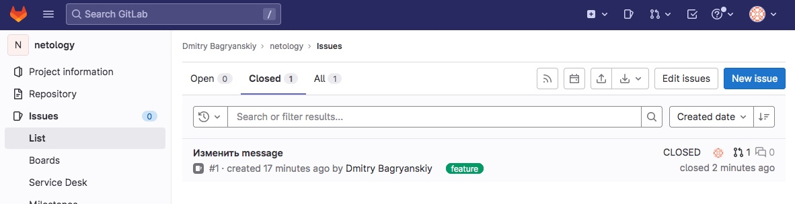

- Перейдем на вкладку CI/CD Pipelines и увидем, что сценарий проигрался

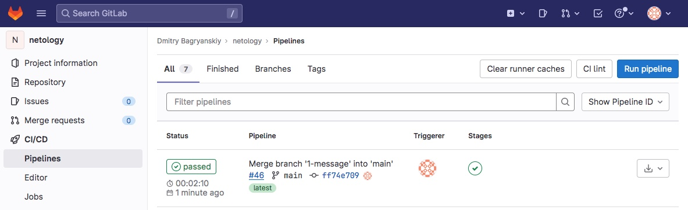

- Перейдем в Gitlab Container Registry и убедимся, что контейнер создан

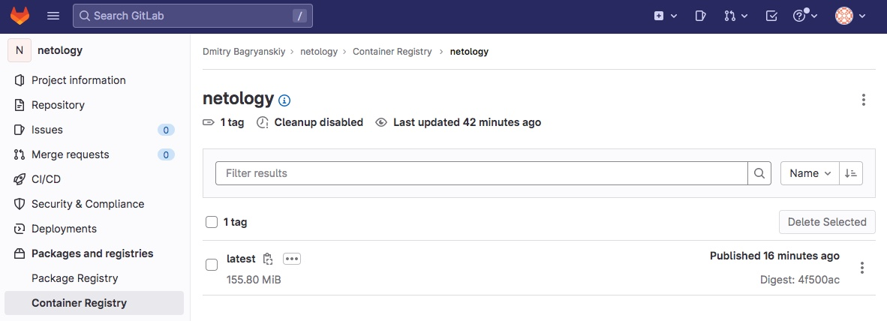

- Проверим контейнер из репозитория

```bash
docker login -u gitlab_username -p gitlab_password gitlab.netology.local:5555
Login Succeeded

docker run --rm -d -p 5290:5290 --name netology gitlab.netology.local:5555/bdv/netology
a0724acbf2ee031b0902975cff1883d39484eddd4187ccb0dbe1ce64209fe046

curl localhost:5290/get_info
{"version": 3, "method": "GET", "message": "Running"}
```
