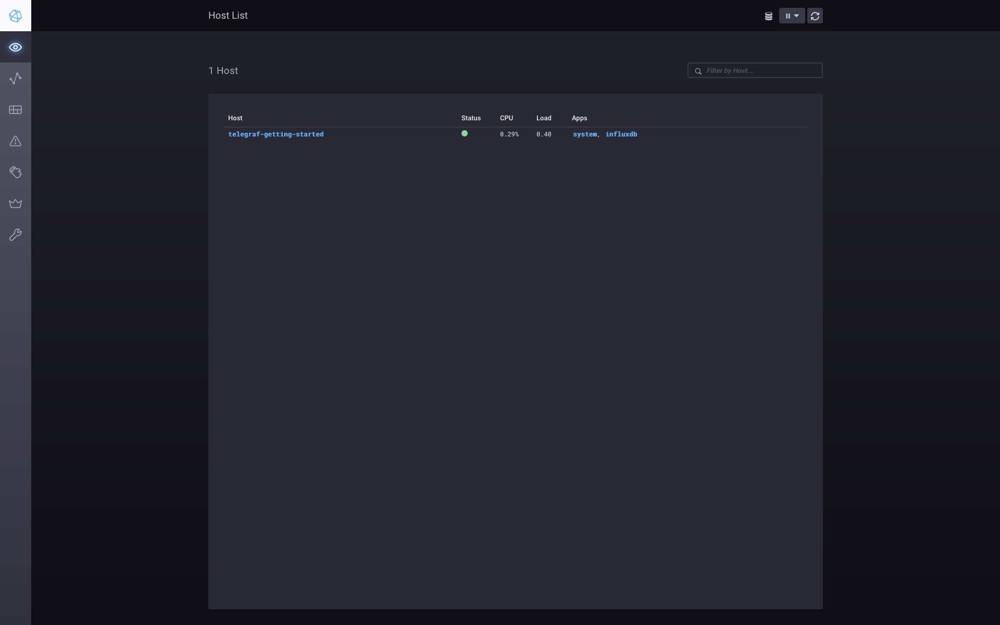
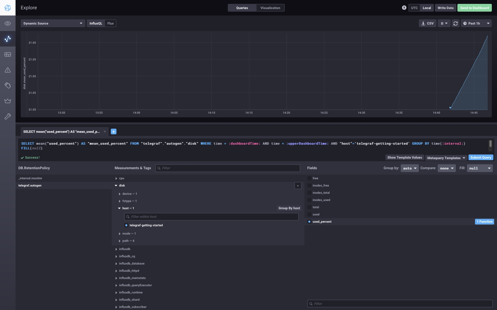
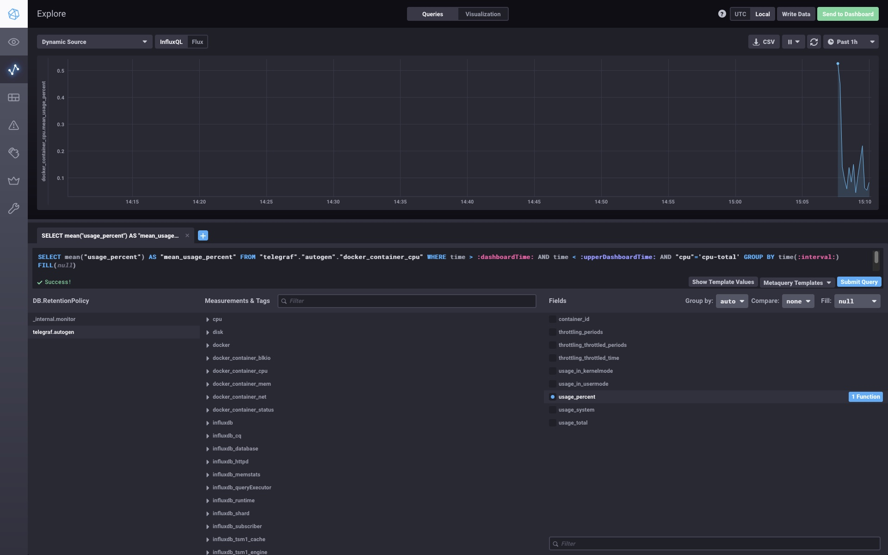

*Студент: Дмитрий Багрянский*

# Домашняя работа

## Урок 10.02 Системы мониторинга.

## Обязательные задания

1. Опишите основные плюсы и минусы pull и push систем мониторинга.

2. Какие из ниже перечисленных систем относятся к push модели, а какие к pull? А может есть гибридные?

    - Prometheus
    - TICK
    - Zabbix
    - VictoriaMetrics
    - Nagios

3. Склонируйте себе [репозиторий](https://github.com/influxdata/sandbox/tree/master) и запустите TICK-стэк,
используя технологии docker и docker-compose.

В виде решения на это упражнение приведите выводы команд с вашего компьютера (виртуальной машины):

    - curl http://localhost:8086/ping
    - curl http://localhost:8888
    - curl http://localhost:9092/kapacitor/v1/ping

А также скриншот веб-интерфейса ПО chronograf (`http://localhost:8888`).

P.S.: если при запуске некоторые контейнеры будут падать с ошибкой - проставьте им режим `Z`, например
`./data:/var/lib:Z`

4. Перейдите в веб-интерфейс Chronograf (`http://localhost:8888`) и откройте вкладку `Data explorer`.

    - Нажмите на кнопку `Add a query`
    - Изучите вывод интерфейса и выберите БД `telegraf.autogen`
    - В `measurments` выберите mem->host->telegraf_container_id , а в `fields` выберите used_percent.
    Внизу появится график утилизации оперативной памяти в контейнере telegraf.
    - Вверху вы можете увидеть запрос, аналогичный SQL-синтаксису.
    Поэкспериментируйте с запросом, попробуйте изменить группировку и интервал наблюдений.

Для выполнения задания приведите скриншот с отображением метрик утилизации места на диске
(disk->host->telegraf_container_id) из веб-интерфейса.

5. Изучите список [telegraf inputs](https://github.com/influxdata/telegraf/tree/master/plugins/inputs).
Добавьте в конфигурацию telegraf следующий плагин - [docker](https://github.com/influxdata/telegraf/tree/master/plugins/inputs/docker):
```
[[inputs.docker]]
  endpoint = "unix:///var/run/docker.sock"
```

Дополнительно вам может потребоваться донастройка контейнера telegraf в `docker-compose.yml` дополнительного volume и
режима privileged:
```
  telegraf:
    image: telegraf:1.4.0
    privileged: true
    volumes:
      - ./etc/telegraf.conf:/etc/telegraf/telegraf.conf:Z
      - /var/run/docker.sock:/var/run/docker.sock:Z
    links:
      - influxdb
    ports:
      - "8092:8092/udp"
      - "8094:8094"
      - "8125:8125/udp"
```

После настройки перезапустите telegraf, обновите веб интерфейс и приведите скриншотом список `measurments` в
веб-интерфейсе базы telegraf.autogen . Там должны появиться метрики, связанные с docker.

Факультативно можете изучить, какие метрики собирает telegraf после выполнения данного задания.

---

###### Ответы:

Все манипуляции проводились в VM с ОС Ubuntu 20.04
Sandbox находится в папке `./src/ansible/stack`

1.

* Плюсы pull систем мониторинга

    - Не нужен агент
    - Упрощается настройка системы, все в одном месте на сервере

* Минусы pull систем мониторинга

    - Увеличивается нагрузка на сервер из-за опроса агентов

* Плюсы push систем мониторинга

    - Не нужно открывать входящие порты для подключения со стороны сервера
    - Настройка каждого агента может быть индивидуальной, для более тонкой настройки
    - Снижается нагрузка на сервер, агент сам инициирует отправку метрик

* Минусы push систем мониторинга

    - Необходим агент
    - Из-за агента, увеличивается время на обслуживание системы

2.
    | Pull | Push |
    |------|------|
    |Prometheus|TICK|
    |Zabbix|Zabbix|
    |VictoriaMetrics|Nagios|

3. Склонировал репозиторий и запустил TICK-стэк в окружении VM

```bash
curl 192.168.99.11:8086/ping
curl 192.168.99.11:8888
<!DOCTYPE html><html><head><link rel="stylesheet" href="/index.c708214f.css"><meta http-equiv="Content-type" content="text/html; charset=utf-8"><title>Chronograf</title><link rel="icon shortcut" href="/favicon.70d63073.ico"></head><body> <div id="react-root" data-basepath=""></div> <script type="module" src="/index.e81b88ee.js"></script><script src="/index.a6955a67.js" nomodule="" defer></script> </body></html>%
curl http://192.168.99.11:9092/kapacitor/v1/ping
```




4. Добавил в `telegraf.conf`
```bash
[[inputs.docker]]
  endpoint = "unix:///var/run/docker.sock"
  container_names = []
  timeout = "5s"
  perdevice = true
  total = false
[[inputs.mem]]
[[inputs.disk]]
  ignore_fs = ["tmpfs", "devtmpfs", "devfs", "iso9660", "overlay", "aufs", "squashfs"]  
```



5. Добавил `privileged: true` в конфигурацию docker-compose.yml для поддержки Docker метрик, также дополнительно потребовалось дать доступ к сокету

```bash
chmod 666 /var/run/docker.sock
```


