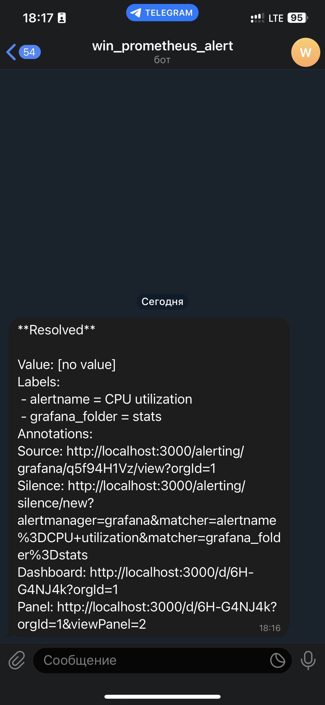

*Студент: Дмитрий Багрянский*

# Домашняя работа

## Урок 10.03 Grafana."

## Задание повышенной сложности

**В части задания 1** не используйте директорию [help](./help) для сборки проекта, самостоятельно разверните grafana, где в
роли источника данных будет выступать prometheus, а сборщиком данных node-exporter:
- grafana
- prometheus-server
- prometheus node-exporter

За дополнительными материалами, вы можете обратиться в официальную документацию grafana и prometheus.

В решении к домашнему заданию приведите также все конфигурации/скрипты/манифесты, которые вы
использовали в процессе решения задания.

**В части задания 3** вы должны самостоятельно завести удобный для вас канал нотификации, например Telegram или Email
и отправить туда тестовые события.

В решении приведите скриншоты тестовых событий из каналов нотификаций.

## Обязательные задания

### Задание 1
Используя директорию [help](./help) внутри данного домашнего задания - запустите связку prometheus-grafana.

Зайдите в веб-интерфейс графана, используя авторизационные данные, указанные в манифесте docker-compose.

Подключите поднятый вами prometheus как источник данных.

Решение домашнего задания - скриншот веб-интерфейса grafana со списком подключенных Datasource.

## Задание 2
Изучите самостоятельно ресурсы:
- [PromQL query to find CPU and memory](https://stackoverflow.com/questions/62770744/promql-query-to-find-cpu-and-memory-used-for-the-last-week)
- [PromQL tutorial](https://valyala.medium.com/promql-tutorial-for-beginners-9ab455142085)
- [Understanding Prometheus CPU metrics](https://www.robustperception.io/understanding-machine-cpu-usage)

Создайте Dashboard и в ней создайте следующие Panels:
- Утилизация CPU для nodeexporter (в процентах, 100-idle)
- CPULA 1/5/15
- Количество свободной оперативной памяти
- Количество места на файловой системе

Для решения данного ДЗ приведите promql запросы для выдачи этих метрик, а также скриншот получившейся Dashboard.

## Задание 3
Создайте для каждой Dashboard подходящее правило alert (можно обратиться к первой лекции в блоке "Мониторинг").

Для решения ДЗ - приведите скриншот вашей итоговой Dashboard.

## Задание 4
Сохраните ваш Dashboard.

Для этого перейдите в настройки Dashboard, выберите в боковом меню "JSON MODEL".

Далее скопируйте отображаемое json-содержимое в отдельный файл и сохраните его.

В решении задания - приведите листинг этого файла.

---

###### Ответы:

1. Для решения задания 1 я не использовал [help](./help), а пользовался собственными манифестами.

```Bash
./src/ansible/roles/sync/files/stack/
❯ tree
.
└── opt
    └── monitoring_stack
        ├── alertmanager
        │   └── config.yml
        ├── docker-compose.yml
        ├── grafana
        │   └── provisioning
        │       └── dashboard.json
        └── prometheus
            ├── alert_rules.yml
            └── prometheus.yml

6 directories, 5 files
```

* Подключим Prometheus как источник данных в Graphana


2. Создадим новый Dashboard

Добавим новые панели:

* Метрика `CPU utilization`
  - PromQL
    - `100 - (rate(node_cpu_seconds_total{job="node", mode="idle"}[1m]) * 100)`
* Метрика `CPU load average`
  - PromQL
    - `node_load1{job="node"}`
    - `node_load5{job="node"}`
    - `node_load15{job="node"}`
* Метрика `Disk free`
  - PromQL
    - `node_filesystem_free_bytes{fstype!~"tmpfs|fuse.lxcfs|squashfs|vfat"}`
* Метрика `Memory free`
  - PromQL
    - `node_memory_MemFree_bytes`


3. Создадим Alert для каждой панели

Пример для панели `Memory free`


Вкладка Alert rules


Общий вид Dashboard


Канал нотификации заведен через Alertmanager.

Для проверки нотификации в Telegram, остановим сервис node-exporter в docker.

```bash
docker stop exporter
```

Prometheus Status Target


Telegram Alert


Telegram Resolve


Также можно завести канал нотификации в Grafana Alerting Contact points


Telegram Alert


Telegram Resolve



4. Листинг dashboard.json

[dashboard.json](./src/ansible/roles/sync/files/stack/opt/monitoring_stack/grafana/provisioning/dashboard.json)
