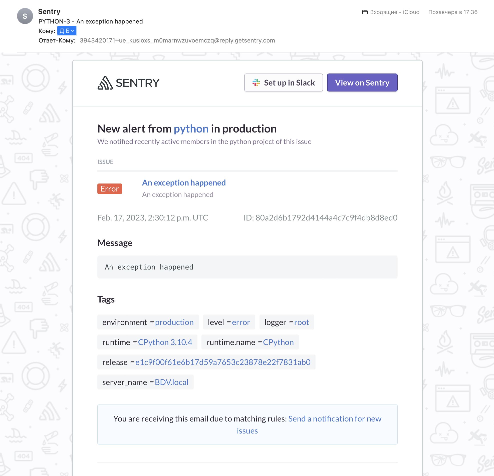

*Студент: Дмитрий Багрянский*

# Домашняя работа

## Урок 10.05 Sentry.

## Задание 1

Так как self-hosted Sentry довольно требовательная к ресурсам система, мы будем использовать Free cloud аккаунт.

Free cloud account имеет следующие ограничения:
- 5 000 errors
- 10 000 transactions
- 1 GB attachments

Для подключения Free cloud account:
- зайдите на sentry.io
- нажжмите "Try for free"
- используйте авторизацию через ваш github-account
- далее следуйте инструкциям

Для выполнения задания - пришлите скриншот меню Projects.

## Задание 2

Создайте python проект и нажмите `Generate sample event` для генерации тестового события.

Изучите информацию, представленную в событии.

Перейдите в список событий проекта, выберите созданное вами и нажмите `Resolved`.

Для выполнения задание предоставьте скриншот `Stack trace` из этого события и список событий проекта, 
после нажатия `Resolved`.

## Задание 3

Перейдите в создание правил алёртинга.

Выберите проект и создайте дефолтное правило алёртинга, без настройки полей.

Снова сгенерируйте событие `Generate sample event`.

Если всё было выполнено правильно - через некоторое время, вам на почту, привязанную к github аккаунту придёт
оповещение о произошедшем событии.

Если сообщение не пришло - проверьте настройки аккаунта Sentry (например привязанную почту), что у вас не было 
`sample issue` до того как вы его сгенерировали и то, что правило алёртинга выставлено по дефолту (во всех полях all).
Также проверьте проект в котором вы создаёте событие, возможно алёрт привязан к другому.

Для выполнения задания - пришлите скриншот тела сообщения из оповещения на почте.

Дополнительно поэкспериментируйте с правилами алёртинга. 
Выбирайте разные условия отправки и создавайте sample events. 

## Задание повышенной сложности

Создайте проект на ЯП python или GO (небольшой, буквально 10-20 строк), подключите к нему sentry SDK и отправьте несколько тестовых событий.
Поэкспериментируйте с различными передаваемыми параметрами, но помните об ограничениях free учетной записи cloud Sentry.

Для выполнения задания пришлите скриншот меню issues вашего проекта и 
пример кода подключения sentry sdk/отсылки событий.

---

###### Ответы:

1. 
2. 
3. 
4. 
```python
import logging
from time import sleep
from sentry_sdk import Hub, init, start_transaction
from sentry_sdk.integrations.logging import LoggingIntegration

sentry_logging = LoggingIntegration( 

    level = logging.INFO,
    event_level = logging.ERROR
)

init(
    dsn="https://{token}.ingest.sentry.io/{id}",
    traces_sample_rate=1.0,
    integrations=[sentry_logging],
)

def sentry_trace(func):
    def wrapper(*args, **kwargs):
        transaction = Hub.current.scope.transaction
        if transaction:
            with transaction.start_child(op=func.__name__):
                return func(*args, **kwargs)
        else:
            with start_transaction(op=func.__name__, name=func.__name__):
                return func(*args, **kwargs)
    return wrapper

@sentry_trace
def b():
    for i in range(1000):
        print(i)
        if(i == 400):
            i = i / (i - 400)            
            
@sentry_trace
def c():
    sleep(2)
    print(1)

@sentry_trace
def a():
    sleep(1)
    b()
    c()

if __name__ == '__main__':
    a()
```

