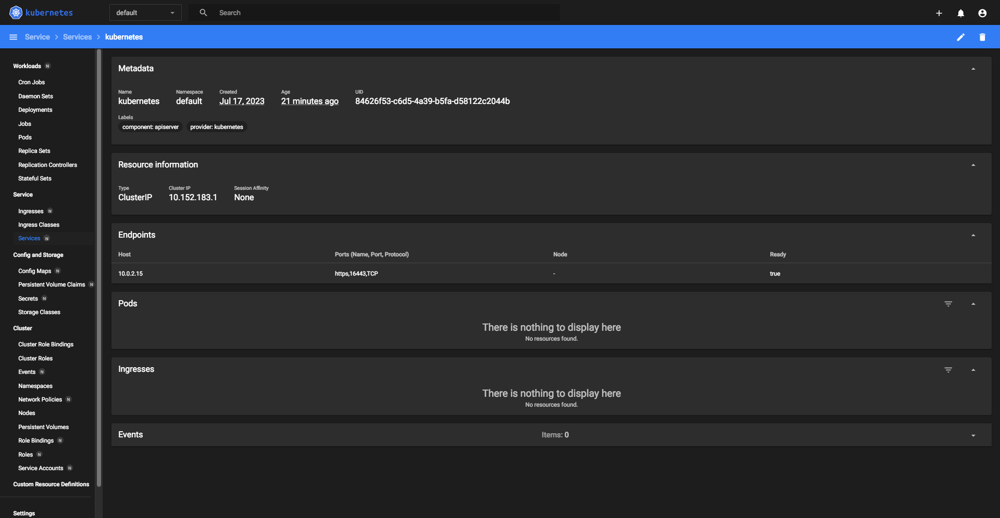

*Студент: Дмитрий Багрянский*

# Домашняя работа

## Урок 12.1.1 «Kubernetes. Причины появления. Команда kubectl»

### Цель задания

Для экспериментов и валидации ваших решений вам нужно подготовить тестовую среду для работы с Kubernetes. Оптимальное решение — развернуть на рабочей машине или на отдельной виртуальной машине MicroK8S.

------

### Чеклист готовности к домашнему заданию

1. Личный компьютер с ОС Linux или MacOS 

или

2. ВМ c ОС Linux в облаке либо ВМ на локальной машине для установки MicroK8S  

------

### Инструкция к заданию

1. Установка MicroK8S:
    - sudo apt update,
    - sudo apt install snapd,
    - sudo snap install microk8s --classic,
    - добавить локального пользователя в группу `sudo usermod -a -G microk8s $USER`,
    - изменить права на папку с конфигурацией `sudo chown -f -R $USER ~/.kube`.

2. Полезные команды:
    - проверить статус `microk8s status --wait-ready`;
    - подключиться к microK8s и получить информацию можно через команду `microk8s command`, например, `microk8s kubectl get nodes`;
    - включить addon можно через команду `microk8s enable`; 
    - список addon `microk8s status`;
    - вывод конфигурации `microk8s config`;
    - проброс порта для подключения локально `microk8s kubectl port-forward -n kube-system service/kubernetes-dashboard 10443:443`.

3. Настройка внешнего подключения:
    - отредактировать файл /var/snap/microk8s/current/certs/csr.conf.template
    ```shell
    # [ alt_names ]
    # Add
    # IP.4 = 123.45.67.89
    ```
    - обновить сертификаты `sudo microk8s refresh-certs --cert front-proxy-client.crt`.

4. Установка kubectl:
    - curl -LO https://storage.googleapis.com/kubernetes-release/release/`curl -s https://storage.googleapis.com/kubernetes-release/release/stable.txt`/bin/linux/amd64/kubectl;
    - chmod +x ./kubectl;
    - sudo mv ./kubectl /usr/local/bin/kubectl;
    - настройка автодополнения в текущую сессию `bash source <(kubectl completion bash)`;
    - добавление автодополнения в командную оболочку bash `echo "source <(kubectl completion bash)" >> ~/.bashrc`.

------

### Инструменты и дополнительные материалы, которые пригодятся для выполнения задания

1. [Инструкция](https://microk8s.io/docs/getting-started) по установке MicroK8S.
2. [Инструкция](https://kubernetes.io/ru/docs/reference/kubectl/cheatsheet/#bash) по установке автодополнения **kubectl**.
3. [Шпаргалка](https://kubernetes.io/ru/docs/reference/kubectl/cheatsheet/) по **kubectl**.

------

### Задание 1. Установка MicroK8S

1. Установить MicroK8S на локальную машину или на удалённую виртуальную машину.
2. Установить dashboard.
3. Сгенерировать сертификат для подключения к внешнему ip-адресу.

------

### Задание 2. Установка и настройка локального kubectl
1. Установить на локальную машину kubectl.
2. Настроить локально подключение к кластеру.
3. Подключиться к дашборду с помощью port-forward.

---
###### Ответ:

Установку производил с помощью Vagrant

Vagrantfile

```bash
ISO = "bento/ubuntu-20.04"
NET = "192.168.99."
DOMAIN = ".netology"
HOST_PREFIX = "server"

servers = [
  {
    :hostname => HOST_PREFIX + "01" + DOMAIN,
    :ip => NET + "101",
    :ssh_host => "20101",
    :ssh_vm => "22",
    :microk8s_host => "10443",
    :microk8s_vm => "443",
    :ram => 4096,
    :core => 1,
    :tags => "",
    :verbose => "true"
  }
]

Vagrant.configure(2) do |config|
  config.vm.synced_folder ".", "/vagrant", disabled: false
  config.ssh.insert_key = false
  config.ssh.private_key_path = ['~/.vagrant.d/insecure_private_key', '~/.ssh/id_rsa']
  config.ssh.forward_agent = true
  servers.each do |machine|
    config.vm.define machine[:hostname] do |node|
      node.vm.box = ISO
      node.vm.hostname = machine[:hostname]
      node.vm.network "private_network", ip: machine[:ip]
      node.vm.network :forwarded_port, guest: machine[:ssh_vm], host: machine[:ssh_host]
      node.vm.network :forwarded_port, guest: machine[:microk8s_vm], host: machine[:microk8s_host]
      node.vm.provider "virtualbox" do |vb|
        vb.customize ["modifyvm", :id, "--memory", machine[:ram]]
        vb.customize ["modifyvm", :id, "--cpus", machine[:core]]
        vb.name = machine[:hostname]
      end
      node.vm.provision "shell", inline: <<-EOF
        apt update
        apt install -y snapd curl
        snap install microk8s --classic
        mkdir -p $HOME/.kube/
        microk8s.status --wait-ready
        microk8s.enable dns dashboard registry
        usermod -a -G microk8s vagrant
        chown -f -R vagrant ~/.kube
        newgrp microk8s
        echo "alias kubectl='microk8s.kubectl'" > /home/vagrant/.bash_aliases
        chown vagrant:vagrant /home/vagrant/.bash_aliases
        echo "alias kubectl='microk8s.kubectl'" > /root/.bash_aliases
        chown root:root /root/.bash_aliases
        microk8s kubectl config view --raw > $HOME/.kube/config
        microk8s refresh-certs --cert front-proxy-client.crt
      EOF
    end
  end
end
```

```bash
vagrant@server01:~$ microk8s status
microk8s is running
high-availability: no
  datastore master nodes: 127.0.0.1:19001
  datastore standby nodes: none
addons:
  enabled:
    dashboard            # (core) The Kubernetes dashboard
    dns                  # (core) CoreDNS
    ha-cluster           # (core) Configure high availability on the current node
    helm                 # (core) Helm - the package manager for Kubernetes
    helm3                # (core) Helm 3 - the package manager for Kubernetes
    hostpath-storage     # (core) Storage class; allocates storage from host directory
    metrics-server       # (core) K8s Metrics Server for API access to service metrics
    registry             # (core) Private image registry exposed on localhost:32000
    storage              # (core) Alias to hostpath-storage add-on, deprecated
  disabled:
    cert-manager         # (core) Cloud native certificate management
    community            # (core) The community addons repository
    gpu                  # (core) Automatic enablement of Nvidia CUDA
    host-access          # (core) Allow Pods connecting to Host services smoothly
    ingress              # (core) Ingress controller for external access
    kube-ovn             # (core) An advanced network fabric for Kubernetes
    mayastor             # (core) OpenEBS MayaStor
    metallb              # (core) Loadbalancer for your Kubernetes cluster
    minio                # (core) MinIO object storage
    observability        # (core) A lightweight observability stack for logs, traces and metrics
    prometheus           # (core) Prometheus operator for monitoring and logging
    rbac                 # (core) Role-Based Access Control for authorisation

vagrant@server01:~$ microk8s kubectl create token default
eyJhbG
...
...
...
TzOonbw

vagrant@server01:~$ microk8s kubectl port-forward -n kube-system service/kubernetes-dashboard 10443:443 --address='0.0.0.0'
Forwarding from 127.0.0.1:10443 -> 8443
Forwarding from [::1]:10443 -> 8443

vagrant@server01:~$ curl -LO https://storage.googleapis.com/kubernetes-release/release/`curl -s https://storage.googleapis.com/kubernetes-release/release/stable.txt`/bin/linux/amd64/kubectl
vagrant@server01:~$ chmod +x ./kubectl
vagrant@server01:~$ sudo mv ./kubectl /usr/local/bin/kubectl
vagrant@server01:~$ kubectl cluster-info
Kubernetes control plane is running at https://127.0.0.1:16443
CoreDNS is running at https://127.0.0.1:16443/api/v1/namespaces/kube-system/services/kube-dns:dns/proxy

To further debug and diagnose cluster problems, use 'kubectl cluster-info dump'.
vagrant@server01:~$ kubectl get nodes
NAME       STATUS   ROLES    AGE   VERSION
server01   Ready    <none>   26m   v1.27.2
```

