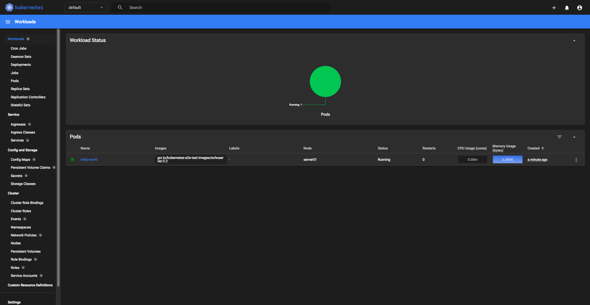
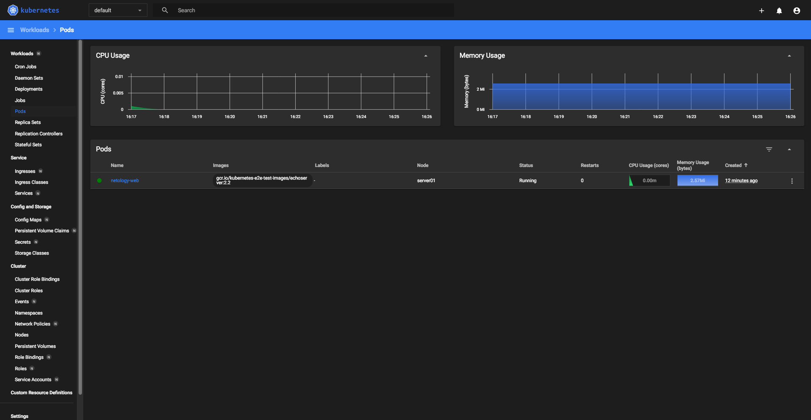
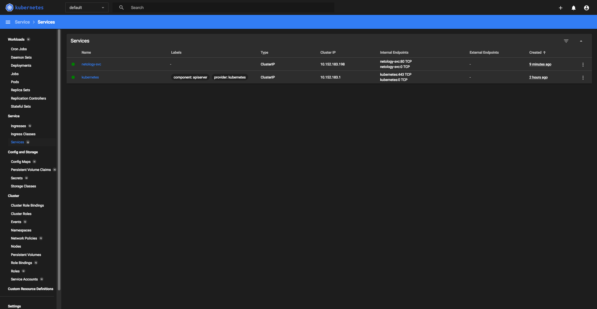
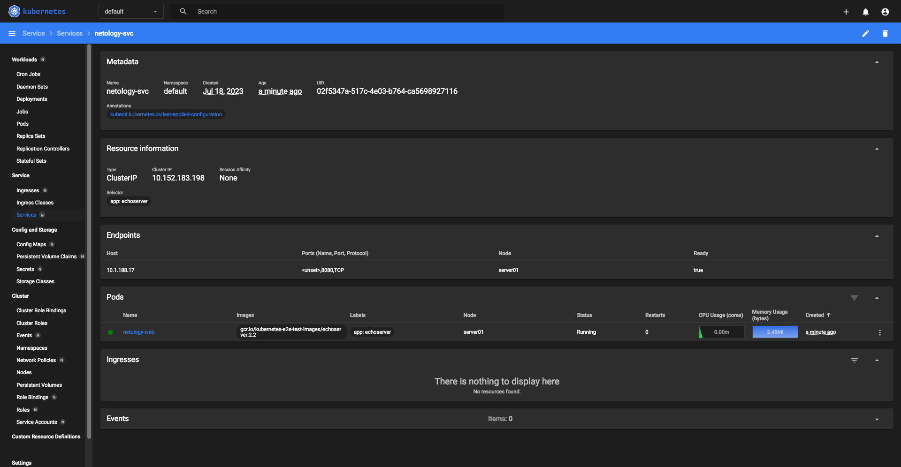

*Студент: Дмитрий Багрянский*

# Домашняя работа

## Урок 12.1.2 «Базовые объекты K8S»

### Цель задания

В тестовой среде для работы с Kubernetes, установленной в предыдущем ДЗ, необходимо развернуть Pod с приложением и подключиться к нему со своего локального компьютера. 

------

### Чеклист готовности к домашнему заданию

1. Установленное k8s-решение (например, MicroK8S).
2. Установленный локальный kubectl.
3. Редактор YAML-файлов с подключенным Git-репозиторием.

------

### Инструменты и дополнительные материалы, которые пригодятся для выполнения задания

1. Описание [Pod](https://kubernetes.io/docs/concepts/workloads/pods/) и примеры манифестов.
2. Описание [Service](https://kubernetes.io/docs/concepts/services-networking/service/).

------

### Задание 1. Создать Pod с именем hello-world

1. Создать манифест (yaml-конфигурацию) Pod.
2. Использовать image - gcr.io/kubernetes-e2e-test-images/echoserver:2.2.
3. Подключиться локально к Pod с помощью `kubectl port-forward` и вывести значение (curl или в браузере).

------

### Задание 2. Создать Service и подключить его к Pod

1. Создать Pod с именем netology-web.
2. Использовать image — gcr.io/kubernetes-e2e-test-images/echoserver:2.2.
3. Создать Service с именем netology-svc и подключить к netology-web.
4. Подключиться локально к Service с помощью `kubectl port-forward` и вывести значение (curl или в браузере).

------
###### Ответ:

### Задание 1. Создать Pod с именем hello-world

1. Создать манифест (yaml-конфигурацию) Pod.
2. Использовать image - gcr.io/kubernetes-e2e-test-images/echoserver:2.2.
3. Подключиться локально к Pod с помощью `kubectl port-forward` и вывести значение (curl или в браузере).

[pod.yml](./src/pod.yml)

#### VM

```bash
vagrant@server01:~$ kubectl port-forward -n kube-system service/kubernetes-dashboard 10443:443 --address='0.0.0.0' &
vagrant@server01:~$ kubectl get nodes
NAME       STATUS   ROLES    AGE   VERSION
server01   Ready    <none>   35m   v1.27.2
vagrant@server01:~$ kubectl apply -f ./pod.yml 
pod/hello-world created
vagrant@server01:~$ kubectl get pods -o wide
NAME          READY   STATUS    RESTARTS   AGE   IP            NODE       NOMINATED NODE   READINESS GATES
hello-world   1/1     Running   0          26s   10.1.188.11   server01   <none>           <none>
vagrant@server01:~$ kubectl port-forward pod/hello-world 8888:8080 --address=0.0.0.0
Forwarding from 0.0.0.0:8888 -> 8080
```

#### Local PC

```bash
curl 192.168.99.101:8888


Hostname: hello-world

Pod Information:
	-no pod information available-

Server values:
	server_version=nginx: 1.12.2 - lua: 10010

Request Information:
	client_address=127.0.0.1
	method=GET
	real path=/
	query=
	request_version=1.1
	request_scheme=http
	request_uri=http://192.168.99.101:8080/

Request Headers:
	accept=*/*
	host=192.168.99.101:8888
	user-agent=curl/7.54.0

Request Body:
	-no body in request-
```




### Задание 2. Создать Service и подключить его к Pod

1. Создать Pod с именем netology-web.
2. Использовать image — gcr.io/kubernetes-e2e-test-images/echoserver:2.2.
3. Создать Service с именем netology-svc и подключить к netology-web.
4. Подключиться локально к Service с помощью `kubectl port-forward` и вывести значение (curl или в браузере).

[service.yml](./src/service.yml)

#### VM

```bash
vagrant@server01:~$ kubectl port-forward -n kube-system service/kubernetes-dashboard 10443:443 --address='0.0.0.0' &
vagrant@server01:~$ kubectl apply -f ./service.yml 
pod/netology-web created
service/netology-svc created
vagrant@server01:~$ kubectl get pods -o wide
NAME           READY   STATUS    RESTARTS   AGE   IP            NODE       NOMINATED NODE   READINESS GATES
netology-web   1/1     Running   0          12m   10.1.188.17   server01   <none>           <none>
vagrant@server01:~$ kubectl get services -o wide
NAME           TYPE        CLUSTER-IP       EXTERNAL-IP   PORT(S)   AGE    SELECTOR
kubernetes     ClusterIP   10.152.183.1     <none>        443/TCP   143m   <none>
netology-svc   ClusterIP   10.152.183.198   <none>        80/TCP    13m    app=echoserver
vagrant@server01:~$ kubectl port-forward service/netology-svc 8888:80 --address=0.0.0.0
Forwarding from 0.0.0.0:8888 -> 8080
Handling connection for 8888
```

#### Local PC

```bash
curl 192.168.99.101:8888


Hostname: netology-web

Pod Information:
	-no pod information available-

Server values:
	server_version=nginx: 1.12.2 - lua: 10010

Request Information:
	client_address=127.0.0.1
	method=GET
	real path=/
	query=
	request_version=1.1
	request_scheme=http
	request_uri=http://192.168.99.101:8080/

Request Headers:
	accept=*/*
	host=192.168.99.101:8888
	user-agent=curl/7.54.0

Request Body:
	-no body in request-
```


