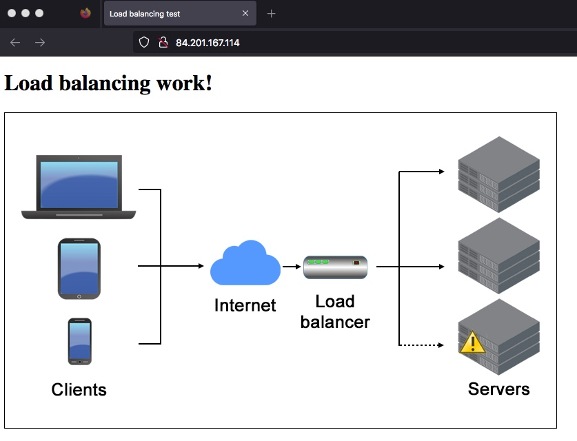
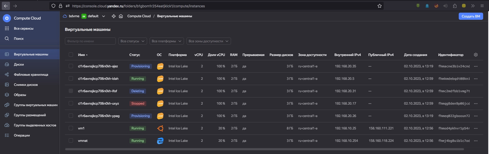

*Студент: Дмитрий Багрянский*

# Домашняя работа

## Урок 14.2 «Вычислительные мощности. Балансировщики нагрузки»  

### Подготовка к выполнению задания

1. Домашнее задание состоит из обязательной части, которую нужно выполнить на провайдере Yandex Cloud, и дополнительной части в AWS (выполняется по желанию). 
2. Все домашние задания в блоке 15 связаны друг с другом и в конце представляют пример законченной инфраструктуры.  
3. Все задания нужно выполнить с помощью Terraform. Результатом выполненного домашнего задания будет код в репозитории. 
4. Перед началом работы настройте доступ к облачным ресурсам из Terraform, используя материалы прошлых лекций и домашних заданий.

---
## Задание 1. Yandex Cloud 

**Что нужно сделать**

1. Создать бакет Object Storage и разместить в нём файл с картинкой:

 - Создать бакет в Object Storage с произвольным именем (например, _имя_студента_дата_).
 - Положить в бакет файл с картинкой.
 - Сделать файл доступным из интернета.
 
2. Создать группу ВМ в public подсети фиксированного размера с шаблоном LAMP и веб-страницей, содержащей ссылку на картинку из бакета:

 - Создать Instance Group с тремя ВМ и шаблоном LAMP. Для LAMP рекомендуется использовать `image_id = fd827b91d99psvq5fjit`.
 - Для создания стартовой веб-страницы рекомендуется использовать раздел `user_data` в [meta_data](https://cloud.yandex.ru/docs/compute/concepts/vm-metadata).
 - Разместить в стартовой веб-странице шаблонной ВМ ссылку на картинку из бакета.
 - Настроить проверку состояния ВМ.
 
3. Подключить группу к сетевому балансировщику:

 - Создать сетевой балансировщик.
 - Проверить работоспособность, удалив одну или несколько ВМ.
4. (дополнительно)* Создать Application Load Balancer с использованием Instance group и проверкой состояния.

Полезные документы:

- [Compute instance group](https://registry.terraform.io/providers/yandex-cloud/yandex/latest/docs/resources/compute_instance_group).
- [Network Load Balancer](https://registry.terraform.io/providers/yandex-cloud/yandex/latest/docs/resources/lb_network_load_balancer).
- [Группа ВМ с сетевым балансировщиком](https://cloud.yandex.ru/docs/compute/operations/instance-groups/create-with-balancer).

---
## Задание 2*. AWS (задание со звёздочкой)

Это необязательное задание. Его выполнение не влияет на получение зачёта по домашней работе.

**Что нужно сделать**

Используя конфигурации, выполненные в домашнем задании из предыдущего занятия, добавить к Production like сети Autoscaling group из трёх EC2-инстансов с  автоматической установкой веб-сервера в private домен.

1. Создать бакет S3 и разместить в нём файл с картинкой:

 - Создать бакет в S3 с произвольным именем (например, _имя_студента_дата_).
 - Положить в бакет файл с картинкой.
 - Сделать доступным из интернета.
2. Сделать Launch configurations с использованием bootstrap-скрипта с созданием веб-страницы, на которой будет ссылка на картинку в S3. 
3. Загрузить три ЕС2-инстанса и настроить LB с помощью Autoscaling Group.

Resource Terraform:

- [S3 bucket](https://registry.terraform.io/providers/hashicorp/aws/latest/docs/resources/s3_bucket)
- [Launch Template](https://registry.terraform.io/providers/hashicorp/aws/latest/docs/resources/launch_template).
- [Autoscaling group](https://registry.terraform.io/providers/hashicorp/aws/latest/docs/resources/autoscaling_group).
- [Launch configuration](https://registry.terraform.io/providers/hashicorp/aws/latest/docs/resources/launch_configuration).

Пример bootstrap-скрипта:

```
#!/bin/bash
yum install httpd -y
service httpd start
chkconfig httpd on
cd /var/www/html
echo "<html><h1>My cool web-server</h1></html>" > index.html
```
### Правила приёма работы

Домашняя работа оформляется в своём Git репозитории в файле README.md. Выполненное домашнее задание пришлите ссылкой на .md-файл в вашем репозитории.
Файл README.md должен содержать скриншоты вывода необходимых команд, а также скриншоты результатов.
Репозиторий должен содержать тексты манифестов или ссылки на них в файле README.md.

----
###### Ответ:

Файл переменных окружения:

<details>
<summary>.tfvars</summary>

```bash
yandex_token                = "y0_A******************************************************"
yandex_zone                 = "ru-central1-a"
yandex_cloud_id             = "b1g*****************"
yandex_folder_id            = "b1g*****************"
yandex_service_acc          = "service-acc01"
yandex_service_admin_acc    = "service-admin-acc01"
yandex_profile              = "profile01"
yandex_nat_image_id         = "fd80mrhj8fl2oe87o4e1" //NAT image
yandex_image_id             = "fd80bm0rh4rkepi5ksdi" //Ubuntu 22.04 LTS
yandex_group_image_id       = "fd827b91d99psvq5fjit" //LAMP image
vm_user_name                = "vmuser"
vm1_user_name               = "vm1user"
vm2_user_name               = "vm2user"
vm_user_name_nat            = "vmusernat"
ssh_key_path                = "~/.ssh/id_rsa.pub"
picture                     = "./img/load-balancing.png"
index_html                  = "./html/index.html"
```

</details>

---

Манифесты `terraform`:

Описание провайдера:
<details>
<summary>main.tf</summary>

```yaml
provider "yandex" {
  service_account_key_file = "key_admin.json"
  cloud_id  = "${var.yandex_cloud_id}"
  folder_id = "${var.yandex_folder_id}"
}
```

</details>

---

Версия:
<details>
<summary>version.tf</summary>

```yaml
terraform {
  required_providers {
    yandex = {
      source = "yandex-cloud/yandex"
    }
  }
  required_version = ">= 0.13"
}
```

</details>

---

Сервисные аккаунты:
<details>
<summary>service-acc.tf</summary>

```yaml
# Service account for access to backet
resource "yandex_iam_service_account" "sa-backet" {
  name        = "sa-backet"
  description = "service account for access to basket"
}

resource "yandex_resourcemanager_folder_iam_member" "sa-storage-editor" {
  folder_id = "${var.yandex_folder_id}"
  role      = "storage.editor"
  member    = "serviceAccount:${yandex_iam_service_account.sa-backet.id}"
}

resource "yandex_iam_service_account_static_access_key" "sa-static-key" {
  service_account_id = "${yandex_iam_service_account.sa-backet.id}"
  description        = "static access key for object storage"
}

#Service account for managing a group of VMs
resource "yandex_iam_service_account" "sa-vm" {
  name        = "sa-vm"
  description = "Service account for managing a group of VMs"
}

resource "yandex_resourcemanager_folder_iam_member" "sa-vm-editor" {
  folder_id = "${var.yandex_folder_id}"
  role      = "editor"
  member    = "serviceAccount:${yandex_iam_service_account.sa-vm.id}"
}
```

</details>

---

Бакет:
<details>
<summary>storage-backet.tf</summary>

```yaml
resource "yandex_storage_bucket" "netology-bucket-2023" {
  access_key = "${yandex_iam_service_account_static_access_key.sa-static-key.access_key}"
  secret_key = "${yandex_iam_service_account_static_access_key.sa-static-key.secret_key}"
  
  bucket     = "netology-bucket-2023"

  max_size = 0

  anonymous_access_flags {
    read = true
    list = false
  }
}
```

</details>

---

Объект для загрузки изображения:
<details>
<summary>picture.tf</summary>

```yaml
resource "yandex_storage_object" "test-picture" {
  access_key = "${yandex_iam_service_account_static_access_key.sa-static-key.access_key}"
  secret_key = "${yandex_iam_service_account_static_access_key.sa-static-key.secret_key}"
  bucket     = "${yandex_storage_bucket.netology-bucket-2023.id}"
  key        = "picture.jpg"
  source     = "${var.picture}"
  content_type = "image/jpg"
  acl = "public-read"
}
```

</details>

---

Группа инстансов:
<details>
<summary>instance-group.tf</summary>

```yaml
resource "yandex_compute_instance_group" "vm-group" {
  name               = "vm-group"
  folder_id          = "${var.yandex_folder_id}"
  service_account_id = "${yandex_iam_service_account.sa-vm.id}"
  
  instance_template {
    platform_id = "standard-v3"
    resources {
      memory = 2
      cores  = 2
    }

    boot_disk {
      initialize_params {
        image_id = "${var.yandex_group_image_id}"
      }
    }

    network_interface {
      network_id = "${yandex_vpc_network.vpc.id}"
      security_group_ids = ["${yandex_vpc_security_group.nat-instance-sg.id}"]
      subnet_ids = ["${yandex_vpc_subnet.private-subnet.id}"]
    }

    metadata = {
      user-data = "${template_file.userdata.rendered}"
    }

    labels = {
      group = "net-lb"
    }

    scheduling_policy {
      preemptible = true
    }
  }

  scale_policy {
    fixed_scale {
      size = 3
    }
  }

  allocation_policy {
    zones = ["${var.yandex_zone}"]
  }

  deploy_policy {
    max_creating = 3
    max_deleting = 1
    max_unavailable = 0
    max_expansion = 2
    startup_duration = 30
  }

  health_check {
    interval = 2
    timeout = 1
    healthy_threshold = 5
    unhealthy_threshold = 2
    http_options {
      path = "/"
      port = 80
    }
  }

  load_balancer {
    target_group_name        = "net-lb-group"
    target_group_description = "Group for network balancer"
  }
}
```

</details>

---

Генерация userdata и index.html из шаблонов:
<details>
<summary>config.tf</summary>

```yaml

resource template_file "userdata" {
  template = "${file("./templates/userdata.yml")}"

  vars = {
    username       = "${var.vm_user_name}"
    ssh_public_key = "${file(var.ssh_key_path)}"
    contents       = "${template_file.index_html_file.rendered}"
  }
}


resource template_file "index_html_file" {
  template = file("${"./html/index.html"}")
  vars = {
    path = "${yandex_storage_bucket.netology-bucket-2023.bucket_domain_name}/${yandex_storage_object.test-picture.key}"
  }
}
```

</details>

---

Сетевой балансир нагрузки:
<details>
<summary>load-balancer.tf</summary>

```yaml

resource "yandex_lb_network_load_balancer" "net-lb" {
  name = "net-lb"

  listener {
    name = "net-lb-listener"
    port = 80
    external_address_spec {
      ip_version = "ipv4"
    }
  }

  attached_target_group {
    target_group_id = "${yandex_compute_instance_group.vm-group.load_balancer.0.target_group_id}"

    healthcheck {
      name = "http"
      interval = 2
      timeout = 1
      unhealthy_threshold = 2
      healthy_threshold = 5
      http_options {
        port = 80
        path = "/"
      }
    }
  }
}
```

</details>

---

NAT инстанс:
<details>
<summary>nat-instance.tf</summary>

```yaml
resource "yandex_compute_instance" "nat-instance" {
  name                      = "vmnat"
  zone                      = "${var.yandex_zone}"
  platform_id               = "standard-v3"
  allow_stopping_for_update = true

  resources {
    core_fraction = 20
    cores         = 2
    memory        = 2
  }

  boot_disk {
    initialize_params {
      image_id = "${var.yandex_nat_image_id}"
    }
  }

  network_interface {
    subnet_id          = "${yandex_vpc_subnet.public-subnet.id}"
    security_group_ids = ["${yandex_vpc_security_group.nat-instance-sg.id}"]
    nat                = true
    ipv4      = true
    ip_address = "192.168.10.254"
  }

  metadata = {
    user-data = "#cloud-config\nusers:\n  - name: ${var.vm_user_name_nat}\n    groups: sudo\n    shell: /bin/bash\n    sudo: 'ALL=(ALL) NOPASSWD:ALL'\n    ssh-authorized-keys:\n      - ${file("${var.ssh_key_path}")}"
  }

  scheduling_policy {
    preemptible = true
  }
  
}
```

</details>

---

Таблица маршрутизации:
<details>
<summary>nat-instance-route.tf</summary>

```yaml
resource "yandex_vpc_route_table" "nat-instance-route" {
  name       = "nat-instance-route"
  network_id = "${yandex_vpc_network.vpc.id}"
  static_route {
    destination_prefix = "0.0.0.0/0"
    next_hop_address   = "${yandex_compute_instance.nat-instance.network_interface.0.ip_address}"
  }
}
```

</details>

---

Сеть:
<details>
<summary>network.tf</summary>

```yaml
# Network
resource "yandex_vpc_network" "vpc" {
  name = "local.network_name"
}

resource "yandex_vpc_subnet" "public-subnet" {
  name = "local.subnet_name1"
  zone           = "ru-central1-a"
  network_id     = "${yandex_vpc_network.vpc.id}"
  v4_cidr_blocks = ["192.168.10.0/24"]
}

resource "yandex_vpc_subnet" "private-subnet" {
  name = "local.subnet_name2"
  zone           = "ru-central1-a"
  network_id     = "${yandex_vpc_network.vpc.id}"
  v4_cidr_blocks = ["192.168.20.0/24"]
  route_table_id = "${yandex_vpc_route_table.nat-instance-route.id}"
}
```

</details>

---

Инстанс для доступа к группе инстансов за NAT:
<details>
<summary>vm1.tf</summary>

```yaml
resource "yandex_compute_instance" "vm1" {
  name                      = "vm1"
  zone                      = "${var.yandex_zone}"
  hostname                  = "vm1.netology.cloud"
  platform_id               = "standard-v3"
  allow_stopping_for_update = true

  resources {
    core_fraction = 20
    cores  = 2
    memory = 2
  }

  boot_disk {
    initialize_params {
      image_id = "${var.yandex_image_id}"
    }
  }

  network_interface {
    subnet_id = "${yandex_vpc_subnet.public-subnet.id}"
    nat = true
  }

  metadata = {
    user-data = "#cloud-config\nusers:\n  - name: ${var.vm1_user_name}\n    groups: sudo\n    shell: /bin/bash\n    sudo: 'ALL=(ALL) NOPASSWD:ALL'\n    ssh-authorized-keys:\n      - ${file("${var.ssh_key_path}")}"
  }

  scheduling_policy {
    preemptible = true
  }
}
```

</details>

---

Переменные:
<details>
<summary>variables.tf</summary>

```yaml
variable "yandex_cloud_id" {
  default = "yandex_cloud_id"
}

variable "yandex_folder_id" {
  default = "yandex_folder_id"
}

variable "yandex_image_id" {
  default = "yandex_image_id"
}

variable "yandex_nat_image_id" {
  default = "yandex_nat_image_id"
}

variable "yandex_group_image_id" {

  default = "yandex_group_image_id"  
}

variable "yandex_zone" {
  default = "yandex_zone"
}

variable "vm_user_name" {
  default = "vm_user_name"
}

variable "vm1_user_name" {
  default = "vm1_user_name"
}

variable "vm2_user_name" {
  default = "vm2_user_name"
}

variable "vm_user_name_nat" {
  default = "vm_user_name_nat"
}

variable "ssh_key_path" {
  default = "ssh_key_path"
}

variable "index_html" {
  default = "index_html"
}

variable "picture" {
  default = "picture"  
}
```

</details>

---

Группа безопасности:
<details>
<summary>security-group.tf</summary>

```yaml
resource "yandex_vpc_security_group" "nat-instance-sg" {
  name       = "local.sg_nat_name"
  network_id = "${yandex_vpc_network.vpc.id}"

  egress {
    protocol       = "ANY"
    description    = "any"
    v4_cidr_blocks = ["0.0.0.0/0"]
  }

  ingress {
    protocol       = "TCP"
    description    = "ssh"
    v4_cidr_blocks = ["0.0.0.0/0"]
    port           = "22"
  }

  ingress {
    protocol       = "TCP"
    description    = "ext-http"
    v4_cidr_blocks = ["0.0.0.0/0"]
    port           = "80"
  }

  ingress {
    protocol       = "TCP"
    description    = "ext-https"
    v4_cidr_blocks = ["0.0.0.0/0"]
    port           = "443"
  }

  ingress {
    protocol       = "ICMP"
    description    = "ext-https"
    v4_cidr_blocks = ["0.0.0.0/0"]
  }
}
```

</details>

---

Описание для вывода внешних и внутренных IP созданных VM
<details>
<summary>output.tf</summary>

```yaml
output "internal_ip_address_group_instance_yandex_cloud" {
  value = "${yandex_compute_instance_group.vm-group.instances.*.network_interface.0.ip_address}"
}

output "external_ip_address_vm1_yandex_cloud" {
  value = "${yandex_compute_instance.vm1.network_interface.0.nat_ip_address}"
}

output "net-lb-address" {
  value = "${yandex_lb_network_load_balancer.net-lb.listener.*.external_address_spec[0].*.address}"
}

output "userdata" {
  value = "${template_file.userdata.rendered}"
}
```

</details>

---

* Инициализация `Yandex.Cloud` используя `shell` скрипт:

  Создаем сервисный аккаунт с ролью `admin`
<details>
<summary>init_yc.sh</summary>

```bash
#!/bin/sh -x
cd ../terraform
yc config profile create ${yandex_profile}
yc config set folder-id ${yandex_folder_id}
yc config set cloud-id ${yandex_cloud_id}
yc config set token ${yandex_token}
yc config set compute-default-zone ${yandex_zone}
yc config profile activate ${yandex_profile}
yc iam service-account create --name ${yandex_service_acc}
yandex_service_acc_id=$(yc iam service-account get ${yandex_service_acc} | awk 'NR==1{print $2}')
yc resource-manager folder add-access-binding ${yandex_folder_id} --role editor --subject serviceAccount:${yandex_service_acc_id}

yc iam service-account create --name ${yandex_service_admin_acc}
yandex_service_admin_acc_id=$(yc iam service-account get ${yandex_service_admin_acc} | awk 'NR==1{print $2}')
yc resource-manager folder add-access-binding ${yandex_folder_id} --role admin --subject serviceAccount:${yandex_service_admin_acc_id}

yc iam key create --service-account-name ${yandex_service_admin_acc} --output key_admin.json
yc iam key create --service-account-name ${yandex_service_acc} --output key_editor.json
yc config set service-account-key key_admin.json
yc config set token ${yandex_token}
```

</details>

</details>

```bash
cd ./shell
source .env
chmod +x ./init_yс.sh
./init_yс.sh
```

* Инициализация `Terraform`

```bash
cd ./terraform
terraform init
```

* Применяем манифесты `terraform`

```bash
terraform apply -auto-approve -var-file=".tfvars"

Apply complete! Resources: 18 added, 0 changed, 0 destroyed.

Outputs:

external_ip_address_vm1_yandex_cloud = "158.160.111.221"
internal_ip_address_group_instance_yandex_cloud = tolist([
  "192.168.20.5",
  "192.168.20.31",
  "192.168.20.17",
])
net-lb-address = tolist([
  "84.201.167.114",
])
userdata = <<EOT
#cloud-config
users:
  - name: vmuser
    ssh-authorized-keys:
      - ssh-rsa AAAAB3NzaC1yc2EAAAADAQABAAABAQDGRJCcWvPLJGsEg4hgjzxLgzzyXDUoTrVMzO8FrB1M9r0b2XMMOBoE6Or4CR3n2wv

    sudo: ['ALL=(ALL) NOPASSWD:ALL']
    groups: sudo
    shell: /bin/bash

write_files:
  - content: |
      <!DOCTYPE html>
      <html lang="en">
        <head>
          <meta charset="UTF-8">
          <title>Load balancing test</title>
        </head>
        <body>
          <h1>Load balancing work!</h1>
          <div>
            
          </div>
         </body>
      </html>
    path: "/var/www/html/index.html"
    owner: root:root
    permissions: "0664"
EOT
```

* Скриншот вывода страницы сетевого балансира:

<p align="center">
  
</p>

* Скриншот остановки двух инстансов группы, балансир начинает создавать два инстанса вместо остановленных:

<p align="center">
  
</p>

* Страница сетевого балансира с выводом картинки по прежнему доступна:

<p align="center">
  
</p>
