*Студент: Дмитрий Багрянский*

# Домашняя работа

## Урок 14.3 «Безопасность в облачных провайдерах»  

Используя конфигурации, выполненные в рамках предыдущих домашних заданий, нужно добавить возможность шифрования бакета.

---
## Задание 1. Yandex Cloud   
<details>
<summary>Yandex Cloud</summary>

1. С помощью ключа в KMS необходимо зашифровать содержимое бакета:

 - создать ключ в KMS;
 - с помощью ключа зашифровать содержимое бакета, созданного ранее.
2. (Выполняется не в Terraform)* Создать статический сайт в Object Storage c собственным публичным адресом и сделать доступным по HTTPS:

 - создать сертификат;
 - создать статическую страницу в Object Storage и применить сертификат HTTPS;
 - в качестве результата предоставить скриншот на страницу с сертификатом в заголовке (замочек).

Полезные документы:

- [Настройка HTTPS статичного сайта](https://cloud.yandex.ru/docs/storage/operations/hosting/certificate).
- [Object Storage bucket](https://registry.terraform.io/providers/yandex-cloud/yandex/latest/docs/resources/storage_bucket).
- [KMS key](https://registry.terraform.io/providers/yandex-cloud/yandex/latest/docs/resources/kms_symmetric_key).

</details>

--- 

## Ответ:

#### 1. С помощью ключа в KMS необходимо зашифровать содержимое бакета.

Используем манифесты `terraform` из предыдущего задания [14-cloud-providers-1.2-computing-power "Computing power. Load Balancers"](https://github.com/bdvme/devops/tree/main/14-cloud-providers-1.2-computing-power).

* создадим ключ в KMS

```yaml
resource "yandex_kms_symmetric_key" "key-a" {
  name              = "key-a"
  description       = "Key for encryption bucket"
  default_algorithm = "AES_128"
  rotation_period   = "8760h" // 1 year
}
```

* зашифруем с помощью ключа содержимое бакета

```yaml

resource "yandex_storage_bucket" "netology-bucket-2023" {
  access_key = "${yandex_iam_service_account_static_access_key.sa-static-key.access_key}"
  secret_key = "${yandex_iam_service_account_static_access_key.sa-static-key.secret_key}"
  
  bucket     = "netology-bucket-2023"

  max_size = 0

  anonymous_access_flags {
    read = true
    list = false
  }

  server_side_encryption_configuration {
    rule {
      apply_server_side_encryption_by_default {
        kms_master_key_id = "${yandex_kms_symmetric_key.key-a.id}"
        sse_algorithm     = "aws:kms"
      }
    }
  }

  depends_on = [ 
    yandex_resourcemanager_folder_iam_member.sa-storage-editor, 
    yandex_resourcemanager_folder_iam_member.sa-storage-enc-dec
  ]
}
```

* добавим в манифест с созданием сервисных записей роль для KMS, для того чтоб сервисный аккаунт `sa-backet` смог добавить в бакет объект.

```yaml
resource "yandex_resourcemanager_folder_iam_member" "sa-storage-enc-dec" {
  folder_id = "${var.yandex_folder_id}"
  role      = "kms.keys.encrypterDecrypter"
  member    = "serviceAccount:${yandex_iam_service_account.sa-backet.id}"
}
```

* Скриншоты:

Сервисные аккаунты:

<p align="center">
  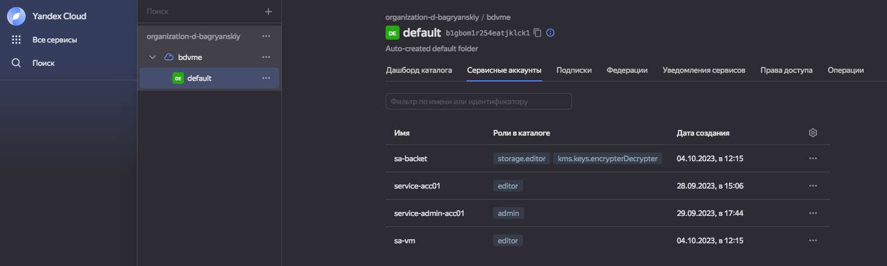
</p>

Создан KMS ключ:

<p align="center">
  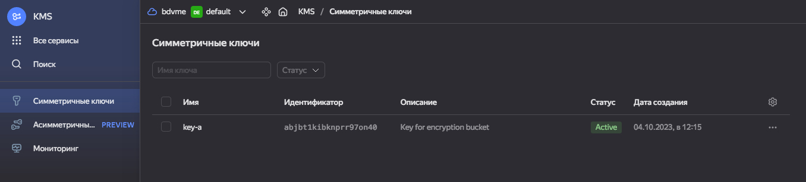
</p>

Включено шифрование бакета:

<p align="center">
  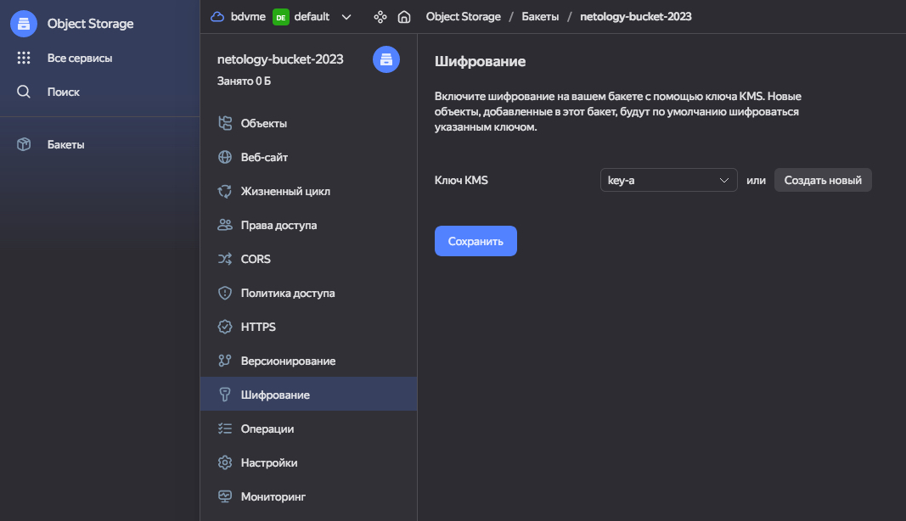
</p>

Проверка чтения содержимого бакета по прямой ссылке:

<p align="center">
  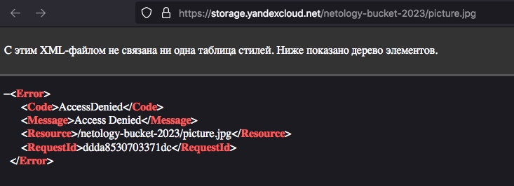
</p>

Содержимое не удается прочитать, так как оно зашифровано.

---

#### 2. (Выполняется не в Terraform)* Создать статический сайт в Object Storage c собственным публичным адресом и сделать доступным по HTTPS

* Создаем бакет с именем совпадающим с доменом.

<p align="center">
  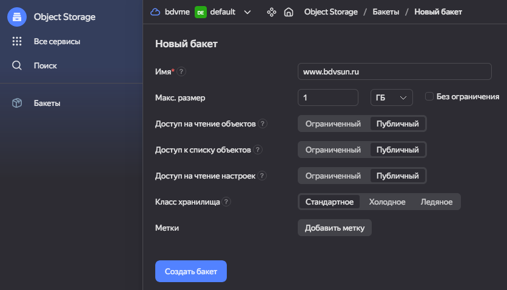
</p>

* Перейдем на вкладку веб-сайт и включим хостинг.

<p align="center">
  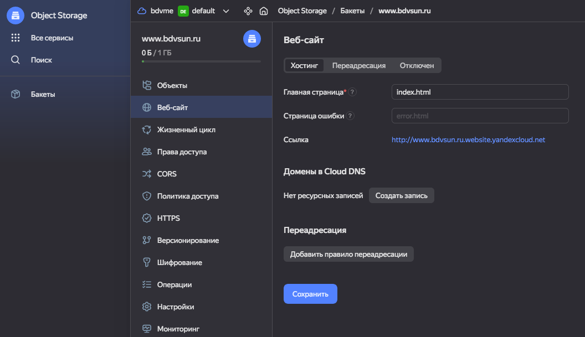
</p>

* Добавим в `Certificate Manager` сертификат через провайдера `Lets Encrypt`

<p align="center">
  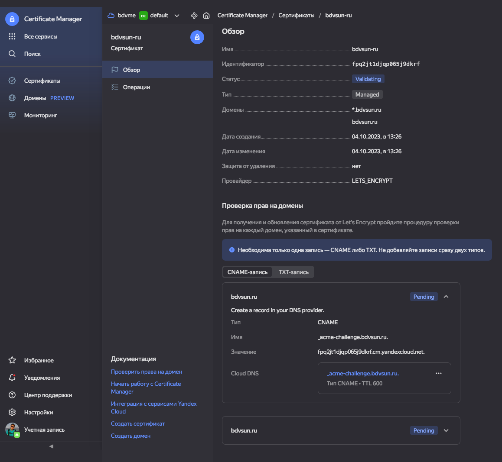
</p>

* Загрузим в бакет объекты `index.html` и `water.jpg`

<p align="center">
  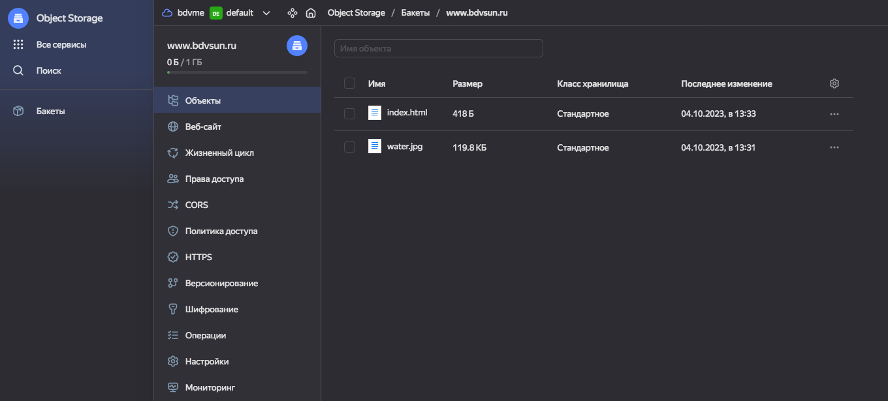
</p>

* Перейдем на вкладку `HTTPS` и выберем сертификат `bdvsun-ru`

<p align="center">
  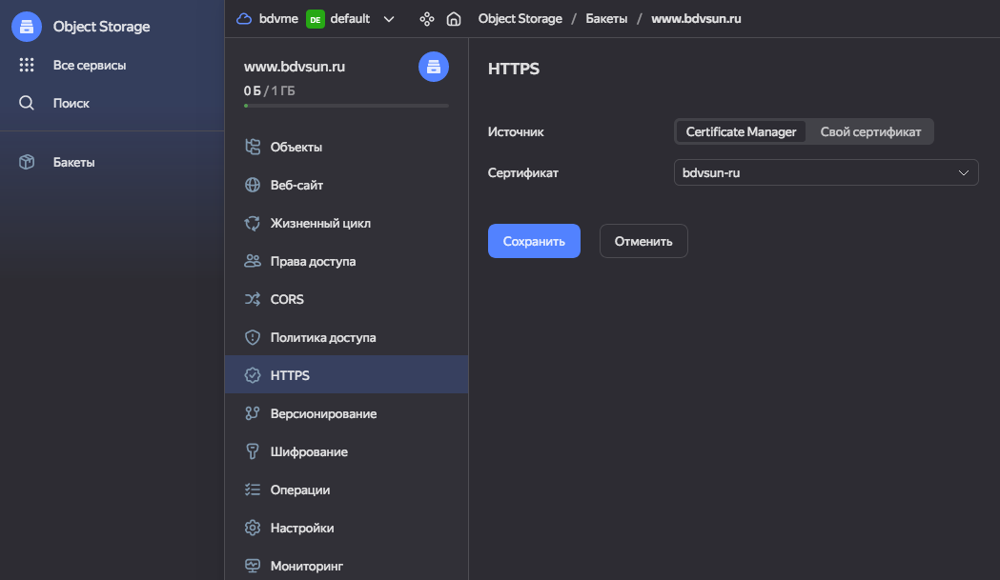
</p>

* Проверим что сайт работает по `https`

<p align="center">
  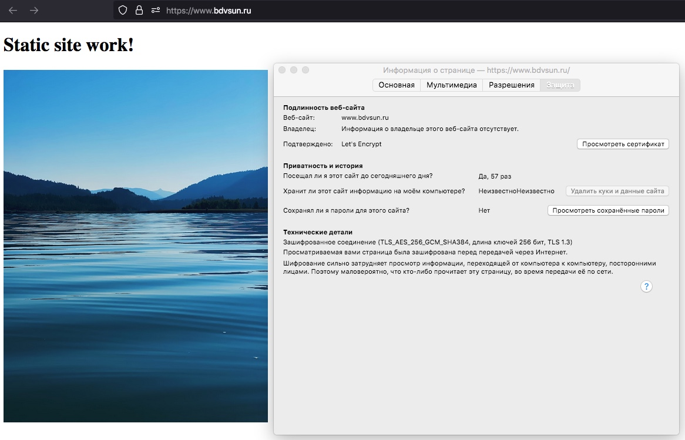
</p>

* Проверим записи в `Cloud DNS`

<p align="center">
  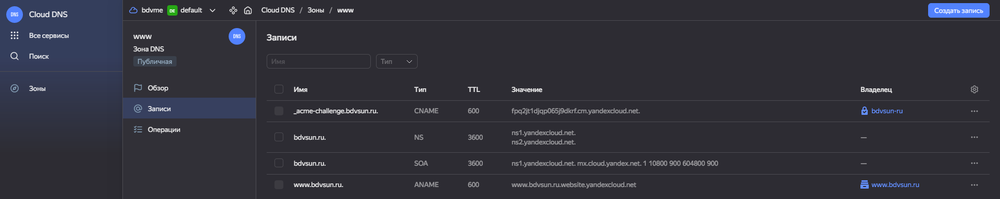
</p>

#### Добьемся того же результата с помощью `terraform`

Описание провайдера
<details>
<summary>main.tf</summary>

```yaml
provider "yandex" {
  service_account_key_file = "key_admin.json"
  cloud_id  = "${var.yandex_cloud_id}"
  folder_id = "${var.yandex_folder_id}"
}
```

</details>

---

Версия
<details>
<summary>version.tf</summary>

```yaml
terraform {
  required_providers {
    yandex = {
      source = "yandex-cloud/yandex"
    }
  }
  required_version = ">= 0.13"
}
```

</details>

---

Сервисные аккаунты
<details>
<summary>service-acc.tf</summary>

```yaml
# Service account for access to backet
resource "yandex_iam_service_account" "sa-backet" {
  name        = "sa-backet"
  description = "service account for access to basket"
}

resource "yandex_resourcemanager_folder_iam_member" "sa-storage-editor" {
  folder_id = "${var.yandex_folder_id}"
  role      = "storage.editor"
  member    = "serviceAccount:${yandex_iam_service_account.sa-backet.id}"
}

resource "yandex_iam_service_account_static_access_key" "sa-static-key" {
  service_account_id = "${yandex_iam_service_account.sa-backet.id}"
  description        = "static access key for object storage"
}

```

</details>

---

Переменные
<details>
<summary>variables.tf</summary>

```yaml
variable "yandex_cloud_id" {
  default = "yandex_cloud_id"
}

variable "yandex_folder_id" {
  default = "yandex_folder_id"
}

variable "yandex_zone" {
  default = "yandex_zone"
}

variable "index_html" {
  default = "index_html"
}

variable "picture" {
  default = "picture"  
}

variable "dns_domain" {
  default = "dns_domain"  
}
```

</details>

---

Получение сертификата через провайдера `Lets Encrypt`
<details>
<summary>certificate.tf</summary>

```yaml
resource "yandex_cm_certificate" "le-certificate" {
  name    = "bdvsun-ru"
  domains = ["${var.dns_domain}", "*.${var.dns_domain}"]

  managed {
  challenge_type = "DNS_CNAME"
  }
}

resource "yandex_dns_recordset" "validation-record" {
  zone_id = "${yandex_dns_zone.zone1.id}"
  name    = "${yandex_cm_certificate.le-certificate.challenges[0].dns_name}"
  type    = "${yandex_cm_certificate.le-certificate.challenges[0].dns_type}"
  data    = [yandex_cm_certificate.le-certificate.challenges[0].dns_value]
  ttl     = 600
}

data "yandex_cm_certificate" "bdvsun-ru" {
  depends_on      = [yandex_dns_recordset.validation-record]
  certificate_id  = "${yandex_cm_certificate.le-certificate.id}"
  wait_validation = true
}

output "cert-id" {
  description = "Certificate ID"
  value       = "${data.yandex_cm_certificate.bdvsun-ru.id}"
}
```

</details>

---

Создание бакета с параметром `website` работающем через протокол `https`
<details>
<summary>storage-bucket.tf</summary>

```yaml
resource "yandex_storage_bucket" "bucket01" {
  access_key = "${yandex_iam_service_account_static_access_key.sa-static-key.access_key}"
  secret_key = "${yandex_iam_service_account_static_access_key.sa-static-key.secret_key}"
  
  bucket     = "www.${var.dns_domain}"

  acl        = "public-read"

  anonymous_access_flags {
    read = true
    list = false
  }

  max_size = 0

  https {
    certificate_id = "${yandex_cm_certificate.le-certificate.id}"
  }

  website {
    index_document = "index.html"
  }
  depends_on = [ 
    yandex_resourcemanager_folder_iam_member.sa-storage-editor,
    yandex_cm_certificate.le-certificate
   ]
}
```

</details>

---

Создание записи в `Cloud DNS`
<details>
<summary>cloud-dns.tf</summary>

```yaml
resource "yandex_dns_zone" "zone1" {
  name   = replace(var.dns_domain, ".", "-")
  zone   = join("", [var.dns_domain, "."])
  public = true
}

resource "yandex_dns_recordset" "rs-aname-1" {
  zone_id = "${yandex_dns_zone.zone1.id}"
  name    = "www"
  type    = "ANAME"
  ttl     = 200
  data    = ["www.${var.dns_domain}.website.yandexcloud.net"]
}
```

</details>

---

Динамическое создание `index.html` из шаблона [index.html](./terraform-2/html/index.html)
<details>
<summary>config.tf</summary>

```yaml
data template_file "index_html_file" {
  template = file("${"./html/index.html"}")
  vars = {
    path = "https://www.${var.dns_domain}/${yandex_storage_object.test-picture.key}"
  }
}
```

</details>

---

Добавление объекта `index.html` в бакет
<details>
<summary>index-html.tf</summary>

```yaml
locals {
  index-html-content = "${data.template_file.index_html_file.rendered}"
}
resource "local_file" "index-file-html" {
  filename = "index.html"
  content  = "${local.index-html-content}"
}
resource "yandex_storage_object" "index-html" {
  access_key = "${yandex_iam_service_account_static_access_key.sa-static-key.access_key}"
  secret_key = "${yandex_iam_service_account_static_access_key.sa-static-key.secret_key}"
  bucket     = "${yandex_storage_bucket.bucket01.id}"
  key        = "index.html"
  source     = "index.html"
  acl = "public-read"
  depends_on = [ 
    local_file.index-file-html,
    yandex_resourcemanager_folder_iam_member.sa-storage-editor,
    yandex_storage_bucket.bucket01
  ]
}
```

</details>

---

Добавление объекта `picture.jpg` в бакет
<details>
<summary>picture.tf</summary>

```yaml
resource "yandex_storage_object" "test-picture" {
  access_key = "${yandex_iam_service_account_static_access_key.sa-static-key.access_key}"
  secret_key = "${yandex_iam_service_account_static_access_key.sa-static-key.secret_key}"
  bucket     = "${yandex_storage_bucket.bucket01.id}"
  key        = "picture.jpg"
  source     = "${var.picture}"
  content_type = "image/jpg"
  acl = "public-read"

  depends_on = [ 
    yandex_resourcemanager_folder_iam_member.sa-storage-editor, 
    yandex_storage_bucket.bucket01 
  ]
}
```

</details>


## Задание 2*. AWS (задание со звёздочкой)
<details>
<summary>AWS</summary>

Это необязательное задание. Его выполнение не влияет на получение зачёта по домашней работе.

**Что нужно сделать**

1. С помощью роли IAM записать файлы ЕС2 в S3-бакет:
 - создать роль в IAM для возможности записи в S3 бакет;
 - применить роль к ЕС2-инстансу;
 - с помощью bootstrap-скрипта записать в бакет файл веб-страницы.
2. Организация шифрования содержимого S3-бакета:

 - используя конфигурации, выполненные в домашнем задании из предыдущего занятия, добавить к созданному ранее бакету S3 возможность шифрования Server-Side, используя общий ключ;
 - включить шифрование SSE-S3 бакету S3 для шифрования всех вновь добавляемых объектов в этот бакет.

3. *Создание сертификата SSL и применение его к ALB:

 - создать сертификат с подтверждением по email;
 - сделать запись в Route53 на собственный поддомен, указав адрес LB;
 - применить к HTTPS-запросам на LB созданный ранее сертификат.

Resource Terraform:

- [IAM Role](https://registry.terraform.io/providers/hashicorp/aws/latest/docs/resources/iam_role).
- [AWS KMS](https://registry.terraform.io/providers/hashicorp/aws/latest/docs/resources/kms_key).
- [S3 encrypt with KMS key](https://registry.terraform.io/providers/hashicorp/aws/latest/docs/resources/s3_bucket_object#encrypting-with-kms-key).

Пример bootstrap-скрипта:

```
#!/bin/bash
yum install httpd -y
service httpd start
chkconfig httpd on
cd /var/www/html
echo "<html><h1>My cool web-server</h1></html>" > index.html
aws s3 mb s3://mysuperbacketname2021
aws s3 cp index.html s3://mysuperbacketname2021
```

</details>

--- 

## Правила приёма работы
<details>
<summary>Правила приёма работы</summary>

Домашняя работа оформляется в своём Git репозитории в файле README.md. Выполненное домашнее задание пришлите ссылкой на .md-файл в вашем репозитории.
Файл README.md должен содержать скриншоты вывода необходимых команд, а также скриншоты результатов.
Репозиторий должен содержать тексты манифестов или ссылки на них в файле README.md.

</details>

